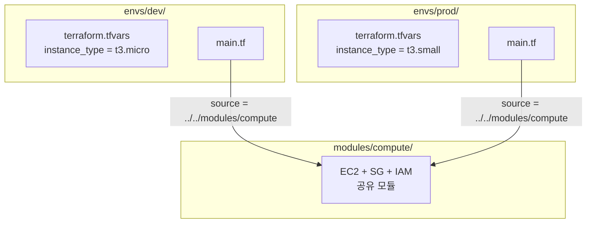

07.02에서 Workspace로 환경을 분리했다. 코드를 공유하면서 State만 분리하는 방식이었다. 이번 섹션에서는 **디렉토리 기반 환경 분리** — 코드와 State를 모두 분리하는 방식을 다룬다. 실무에서 더 선호되는 이 방식의 구조, Backend 분리, tfvars 관리를 이해하고 직접 구성한다.

# 디렉토리 기반 환경 분리

## 1. 기본 구조

환경별 디렉토리를 독립된 root module로 사용하고, 인프라 코드는 공유 모듈로 분리한다.

```text
project/
├── modules/                    ← 공유 모듈
│   ├── network/
│   ├── platform/
│   └── workload/
└── envs/
    ├── dev/                    ← dev 환경 root module
    │   ├── main.tf             ← modules/ 호출
    │   ├── providers.tf
    │   ├── variables.tf
    │   ├── outputs.tf
    │   └── terraform.tfvars    ← dev 전용 변수값
    └── prod/                   ← prod 환경 root module
        ├── main.tf
        ├── providers.tf
        ├── variables.tf
        ├── outputs.tf
        └── terraform.tfvars    ← prod 전용 변수값
```

각 `envs/{env}/` 디렉토리는 **독립된 root module**이다. `terraform init`, `plan`, `apply`를 디렉토리별로 독립 실행한다. `.terraform/` 디렉토리와 State 파일도 각각 생성된다.

모듈 참조는 상대경로로 한다:

```hcl
# envs/dev/main.tf
module "compute" {
  source = "../../modules/compute"

  namespace     = local.namespace
  instance_type = var.instance_type
}
```

`source`의 상대경로는 호출하는 파일이 위치한 디렉토리 기준이다. `envs/dev/main.tf`에서 `../../modules/compute`는 프로젝트 루트의 `modules/compute`를 가리킨다.

## 2. Backend 분리

### ① 환경별 backend.tf 직접 작성

각 환경 디렉토리에 backend 설정을 하드코딩한다. 가장 단순한 방식이다.

```hcl
# envs/dev/providers.tf
terraform {
  backend "s3" {
    bucket = "tf-core-tfstate"
    key    = "dev/gallery/terraform.tfstate"
    region = "ap-northeast-2"
  }
}
```

```hcl
# envs/prod/providers.tf
terraform {
  backend "s3" {
    bucket = "tf-core-tfstate"
    key    = "prod/gallery/terraform.tfstate"
    region = "ap-northeast-2"
  }
}
```

코드만 보면 State 경로가 즉시 확인된다. 환경 디렉토리마다 `key` 값이 다르므로 State가 자연스럽게 분리된다.

### ② Partial Backend Configuration

backend 블록에는 타입만 선언하고, 환경별 값은 별도 파일로 분리한다.

```hcl
# envs/dev/providers.tf (환경 공통)
terraform {
  backend "s3" {}
}
```

```hcl
# backend-dev.hcl
bucket = "tf-core-tfstate"
key    = "dev/gallery/terraform.tfstate"
region = "ap-northeast-2"
```

```bash
$ cd envs/dev
$ terraform init -backend-config="../../backend-dev.hcl"
```

CI/CD 파이프라인에서 환경변수로 backend 설정을 조립할 때 유용하다. 커맨드라인 key-value 방식도 가능하다:

```bash
$ terraform init \
  -backend-config="bucket=tf-core-tfstate" \
  -backend-config="key=dev/gallery/terraform.tfstate" \
  -backend-config="region=ap-northeast-2"
```

> backend 블록에서는 변수·locals·표현식을 사용할 수 없다. `key = "${var.env}/terraform.tfstate"` 같은 표현은 **불가**다. 이 제약 때문에 환경별 하드코딩 또는 partial config가 필요하다.

## 3. tfvars 관리

각 환경 디렉토리에 `terraform.tfvars`를 배치하면 해당 디렉토리에서 `plan`/`apply` 실행 시 **자동 로드**된다.

```hcl
# envs/dev/terraform.tfvars
env           = "dev"
instance_type = "t3.micro"
```

```hcl
# envs/prod/terraform.tfvars
env           = "prod"
instance_type = "t3.small"
```

`-var-file` 플래그 없이 환경별 값이 적용된다. 이것이 디렉토리 분리의 편리함이다 — 디렉토리에 들어가서 `apply`하면 그 환경의 설정이 자동으로 적용된다.

자동 로드 대상:

| 파일 | 로드 조건 |
|------|----------|
| `terraform.tfvars` | 존재하면 자동 로드 |
| `*.auto.tfvars` | 존재하면 lexical 순서로 자동 로드 |

> 상위 디렉토리의 `terraform.tfvars`는 자동 로드되지 않는다. `envs/dev/`에서 실행하면 `envs/dev/terraform.tfvars`만 로드된다.

## 4. 환경 디렉토리는 "얇게"

환경 디렉토리의 역할은 **모듈 호출 + 변수 주입**이다. 인프라 로직은 공유 모듈에 집중한다.

```hcl
# envs/dev/main.tf — 최소한의 호출
module "infra" {
  source = "../../modules/infra"

  namespace     = local.namespace
  instance_type = var.instance_type
}
```

환경 디렉토리가 얇을수록 환경 간 코드 동기화 부담이 줄어든다. 환경별 차이는 `terraform.tfvars`의 값으로만 표현하는 것이 이상적이다. 환경별로 리소스 구성 자체가 달라야 하면 (dev에는 없는 리소스가 prod에만 필요) 모듈 호출을 추가하면 된다 — Workspace의 `count` 조건식보다 명확하다.

---

# 핵심 정리

- 디렉토리 기반 분리는 각 환경이 독립된 root module이다 — `init`, `plan`, `apply` 모두 독립
- 공유 모듈을 상대경로(`../../modules/`)로 참조하고, 환경별 `terraform.tfvars`로 값을 주입한다
- Backend 분리: 환경별 `key` 하드코딩 또는 `-backend-config` partial config
- 환경 디렉토리는 "얇게" — 모듈 호출 + 변수 주입 역할만
- Workspace 전환 실수가 없다 — 디렉토리 자체가 환경을 결정한다

---

# 참고 자료

- [Organize Configuration — Terraform 공식 튜토리얼](https://developer.hashicorp.com/terraform/tutorials/modules/organize-configuration)
- [Backend Configuration — Terraform 공식 문서](https://developer.hashicorp.com/terraform/language/backend/configuration)
- [Input Variables (tfvars 우선순위) — Terraform 공식 문서](https://developer.hashicorp.com/terraform/language/values/variables)

---

# [실습] lab01: 디렉토리 기반 환경 구조 구성

# 1. 전체 아키텍처



동일한 공유 모듈(`modules/compute/`)을 dev와 prod 환경이 각각 호출한다. 환경별 `terraform.tfvars`가 다른 값을 주입하고, State는 디렉토리별로 독립된다.

---

# 2. 사전 준비

```text
lab01/
├── modules/
│   └── compute/
│       ├── main.tf
│       ├── variables.tf
│       ├── outputs.tf
│       └── datasources.tf
└── envs/
    ├── dev/
    │   ├── providers.tf
    │   ├── locals.tf
    │   ├── variables.tf
    │   ├── main.tf
    │   ├── outputs.tf
    │   └── terraform.tfvars
    └── prod/
        ├── providers.tf
        ├── locals.tf
        ├── variables.tf
        ├── main.tf
        ├── outputs.tf
        └── terraform.tfvars
```

**설정:**

- region: **`ap-northeast-2`**
- dev: instance_type **`t3.micro`**
- prod: instance_type **`t3.small`**

---

# 3. 공유 모듈: modules/compute/

EC2 + SG + IAM을 생성하는 공유 모듈이다. 환경과 무관한 인프라 로직만 포함한다.

## datasources.tf

```hcl
data "aws_ami" "amazon_linux" {
  most_recent = true

  filter {
    name   = "name"
    values = ["al2023-ami-*-x86_64"]
  }

  owners = ["amazon"]
}

data "aws_vpc" "default" {
  default = true
}

data "aws_subnets" "default" {
  filter {
    name   = "vpc-id"
    values = [data.aws_vpc.default.id]
  }
}

data "aws_iam_policy_document" "ec2_assume_role" {
  statement {
    actions = ["sts:AssumeRole"]
    effect  = "Allow"

    principals {
      type        = "Service"
      identifiers = ["ec2.amazonaws.com"]
    }
  }
}

data "aws_iam_policy" "ssm_core" {
  name = "AmazonSSMManagedInstanceCore"
}
```

## variables.tf

```hcl
variable "namespace" {
  type = string
}

variable "instance_type" {
  type = string
}
```

모듈 인터페이스는 최소화한다. `namespace`와 `instance_type`만 외부에서 주입받는다.

## main.tf

```hcl
resource "aws_iam_role" "instance" {
  name               = "${var.namespace}-iamrole-instance"
  assume_role_policy = data.aws_iam_policy_document.ec2_assume_role.json

  tags = {
    Name = "${var.namespace}-iamrole-instance"
  }
}

resource "aws_iam_role_policy_attachment" "instance_ssm" {
  role       = aws_iam_role.instance.name
  policy_arn = data.aws_iam_policy.ssm_core.arn
}

resource "aws_iam_instance_profile" "instance" {
  name = "${var.namespace}-iamprofile-instance"
  role = aws_iam_role.instance.name

  tags = {
    Name = "${var.namespace}-iamprofile-instance"
  }
}

resource "aws_security_group" "instance" {
  name   = "${var.namespace}-sg-instance"
  vpc_id = data.aws_vpc.default.id

  egress {
    from_port   = 0
    to_port     = 0
    protocol    = "-1"
    cidr_blocks = ["0.0.0.0/0"]
  }

  tags = {
    Name = "${var.namespace}-sg-instance"
  }
}

resource "aws_instance" "web" {
  ami                    = data.aws_ami.amazon_linux.id
  instance_type          = var.instance_type
  subnet_id              = data.aws_subnets.default.ids[0]
  vpc_security_group_ids = [aws_security_group.instance.id]
  iam_instance_profile   = aws_iam_instance_profile.instance.name

  tags = {
    Name = "${var.namespace}-instance-web"
  }
}
```

## outputs.tf

```hcl
output "instance" {
  value = {
    id            = aws_instance.web.id
    instance_type = aws_instance.web.instance_type
    private_ip    = aws_instance.web.private_ip
  }
}
```

---

# 4. 환경 디렉토리: envs/dev/

환경 디렉토리는 "얇게" — 모듈 호출과 변수 주입만 담당한다.

## terraform.tfvars

```hcl
env           = "dev"
instance_type = "t3.micro"
```

이 파일은 `envs/dev/`에서 `plan`/`apply` 실행 시 자동 로드된다.

## variables.tf

```hcl
variable "env" {
  type = string

  validation {
    condition     = contains(["dev", "stg", "prod"], var.env)
    error_message = "env는 dev, stg, prod 중 하나여야 한다."
  }
}

variable "instance_type" {
  type = string

  validation {
    condition     = contains(["t3.micro", "t3.small", "t3.medium"], var.instance_type)
    error_message = "instance_type은 t3.micro, t3.small, t3.medium 중 하나여야 한다."
  }
}
```

## providers.tf

```hcl
terraform {
  required_version = ">= 1.14.0"

  required_providers {
    aws = {
      source  = "hashicorp/aws"
      version = "~> 6.0"
    }
  }
}

provider "aws" {
  region = "ap-northeast-2"

  default_tags {
    tags = {
      Organization = local.org
      Project      = local.project
      Environment  = local.environment
      ManagedBy    = "Terraform"
    }
  }
}
```

## locals.tf

```hcl
locals {
  org         = "tf-core"
  project     = "lab01"
  environment = var.env

  namespace = "${local.org}-${local.project}-${local.environment}"
}
```

`var.env`는 `terraform.tfvars`에서 자동 주입된다. Workspace와 달리 `terraform.workspace`가 아닌 `var.env`를 사용한다 — 디렉토리 분리에서는 변수 주입이 환경 결정 메커니즘이다.

## main.tf

```hcl
module "compute" {
  source = "../../modules/compute"

  namespace     = local.namespace
  instance_type = var.instance_type
}
```

공유 모듈을 호출하고, namespace와 instance_type을 주입한다. 이것이 환경 디렉토리의 전부다.

## outputs.tf

```hcl
output "environment" {
  value = local.environment
}

output "compute" {
  value = module.compute.instance
}
```

---

# 5. 환경 디렉토리: envs/prod/

`envs/dev/`와 **동일한 코드**다. `terraform.tfvars`만 다르다.

## terraform.tfvars

```hcl
env           = "prod"
instance_type = "t3.small"
```

나머지 파일(`providers.tf`, `locals.tf`, `variables.tf`, `main.tf`, `outputs.tf`)은 `envs/dev/`와 동일하다. 이것이 "얇은 환경 디렉토리"의 장점이다 — 환경별 차이는 `terraform.tfvars` 한 파일로 표현된다.

---

# 6. dev 환경 배포

```bash
$ cd envs/dev
$ terraform init
```

```text
Initializing the backend...
Initializing modules...
- compute in ../../modules/compute

Terraform has been successfully initialized!
```

모듈이 상대경로(`../../modules/compute`)에서 로드된다.

```bash
$ terraform apply -auto-approve
```

```text
Apply complete! Resources: 5 added, 0 changed, 0 destroyed.

Outputs:

compute = {
  "id"            = "i-0aaa..."
  "instance_type" = "t3.micro"
  "private_ip"    = "172.31.xxx.xxx"
}
environment = "dev"
```

dev 환경에서 `t3.micro` 인스턴스가 생성되었다.

---

# 7. prod 환경 배포

```bash
$ cd ../prod
$ terraform init
```

```text
Initializing the backend...
Initializing modules...
- compute in ../../modules/compute

Terraform has been successfully initialized!
```

`envs/prod/`에서 독립적으로 `init`한다. 자체 `.terraform/` 디렉토리가 생성된다.

```bash
$ terraform apply -auto-approve
```

```text
Apply complete! Resources: 5 added, 0 changed, 0 destroyed.

Outputs:

compute = {
  "id"            = "i-0bbb..."
  "instance_type" = "t3.small"
  "private_ip"    = "172.31.xxx.xxx"
}
environment = "prod"
```

동일한 모듈 코드에서 `terraform.tfvars`의 값만 달라졌다. `t3.small`이 적용되었다.

---

# 8. 결과 확인

두 환경의 State가 완전히 독립됨을 확인한다.

```bash
$ ls envs/dev/terraform.tfstate
$ ls envs/prod/terraform.tfstate
```

```text
envs/dev/terraform.tfstate
envs/prod/terraform.tfstate
```

각 디렉토리에 자체 State 파일이 존재한다. `envs/dev/`에서 `destroy`해도 `envs/prod/`에 영향이 없다.

```bash
$ cd envs/dev
$ terraform output -json compute | jq '.instance_type'
```

```text
"t3.micro"
```

```bash
$ cd ../prod
$ terraform output -json compute | jq '.instance_type'
```

```text
"t3.small"
```

Workspace와의 차이: Workspace에서는 `terraform workspace select`로 전환했다. 디렉토리 분리에서는 `cd`로 이동한다 — 물리적 디렉토리가 환경을 결정하므로 전환 실수 위험이 없다.

---

# 9. 정리

```bash
$ cd envs/dev
$ terraform destroy -auto-approve

$ cd ../prod
$ terraform destroy -auto-approve
```

```text
Destroy complete! Resources: 5 destroyed.
```

각 환경을 독립적으로 destroy한다. 다른 환경에 영향 없다.

---

# 핵심 정리

- 디렉토리 기반 분리에서 각 환경은 독립된 root module이다 — `init`, State 모두 독립
- 공유 모듈은 상대경로(`../../modules/`)로 참조한다
- `terraform.tfvars`가 디렉토리별로 자동 로드된다 — `-var-file` 불필요
- 환경 디렉토리는 "얇게" — 모듈 호출 + 변수 주입만 담당
- Workspace의 `terraform workspace select` 전환이 없다 — `cd`로 환경 결정
- Backend 분리: 환경별 `key` 하드코딩 또는 `-backend-config` partial config

---

# 참고 자료

- [Organize Configuration — Terraform 공식 튜토리얼](https://developer.hashicorp.com/terraform/tutorials/modules/organize-configuration)
- [Backend Configuration — Terraform 공식 문서](https://developer.hashicorp.com/terraform/language/backend/configuration)
