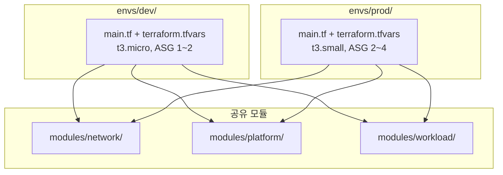

Ch05 Gallery에서 3-Layer 모듈(network/platform/workload) 기반으로 ALB + ASG 구성을 완성했다. 이번 Gallery에서는 이 인프라를 **dev/prod 환경으로 분리**한다. 07.03에서 학습한 디렉토리 기반 환경 분리를 실제 Gallery 인프라에 적용한다.

| Chapter | Gallery 실습 | 핵심 변화 |
|---------|------------|----------|
| Ch02 | EC2 기본 배포 | 수동 설치 (SSM 접속). Local State |
| Ch04 | user_data 자동화 + Remote Backend | user_data + systemd. S3 Remote State |
| Ch05 | ALB + ASG | 3-Layer 모듈, Launch Template + ASG. `ALB:80` |
| **Ch07** | **dev/prod 환경 분리** | **디렉토리 기반 분리. envs/dev, envs/prod** |

이번 Gallery는 Ch06 Gallery(3-tier 확장)가 아닌 **Ch05 Gallery를 기반**으로 한다. 환경 분리의 핵심은 "같은 인프라를 다른 설정으로 배포하는 것"이다. ALB + ASG 구조만으로 환경 분리의 모든 패턴을 체험할 수 있다. 인프라가 커지면 환경 분리 자체보다 인프라 구축에 시간을 뺏긴다.

### 실습 목표

- Ch05 Gallery의 3-Layer 모듈 구조를 디렉토리 기반으로 dev/prod 분리한다
- 환경별 `terraform.tfvars`로 인스턴스 타입, ASG 용량을 차별화한다
- S3 Backend에서 환경별 State를 key prefix로 분리한다
- dev 환경 배포 후 Gallery 앱 동작을 확인한다

---

# 1. 전체 아키텍처



Ch05 Gallery의 3-Layer 모듈(network/platform/workload)이 그대로 유지된다. 변경점은 root 모듈이 `envs/dev/`와 `envs/prod/`로 분리된 것뿐이다. 모듈 코드는 공유하고, 환경별 차이는 `terraform.tfvars`로만 표현한다.

**환경별 차이:**

| 설정 | dev | prod |
|------|-----|------|
| instance_type | `t3.micro` | `t3.small` |
| ASG min / max / desired | 1 / 2 / 1 | 2 / 4 / 2 |
| S3 State key | `dev/gallery/terraform.tfstate` | `prod/gallery/terraform.tfstate` |

---

# 2. 사전 준비

- Ch05 Gallery(05.03) 완료
- Ch07 Sec01~04 완료
- S3 tfstate 버킷 존재 (`tf-core-tfstate`)

**Ch05 Gallery 코드를 복사해 시작한다.** `modules/` 디렉토리를 포함해 복사한다.

```bash
$ cp -r "05 모듈/03 [실습] Gallery: 인프라 모듈화/." "07 환경 분리/05 [실습] Gallery: dev·prod 환경 분리/"
```

복사 후 기존 root 모듈 파일(`main.tf`, `locals.tf`, `providers.tf`, `variables.tf`, `outputs.tf`)을 `envs/dev/`로 이동하고, `envs/prod/`에 복사한다.

**디렉토리 구조:**

```text
Gallery - dev·prod 환경 분리/
├── modules/
│   ├── network/
│   │   ├── vpc.tf
│   │   ├── subnet.tf
│   │   ├── natgw.tf
│   │   ├── locals.tf
│   │   ├── variables.tf
│   │   └── outputs.tf
│   ├── platform/
│   │   ├── lb.tf
│   │   ├── iam.tf
│   │   ├── locals.tf
│   │   ├── datasources.tf
│   │   ├── variables.tf
│   │   └── outputs.tf
│   └── workload/
│       ├── asg.tf
│       ├── locals.tf
│       ├── datasources.tf
│       ├── variables.tf
│       ├── outputs.tf
│       └── templates/
│           └── user_data.sh.tpl
└── envs/
    ├── dev/
    │   ├── main.tf
    │   ├── locals.tf
    │   ├── providers.tf
    │   ├── variables.tf
    │   ├── outputs.tf
    │   └── terraform.tfvars
    └── prod/
        ├── main.tf
        ├── locals.tf
        ├── providers.tf
        ├── variables.tf
        ├── outputs.tf
        └── terraform.tfvars
```

`modules/`는 Ch05 Gallery에서 **변경 없이** 그대로 사용한다. 새로 작성하는 것은 `envs/dev/`와 `envs/prod/` 디렉토리뿐이다.

---

# 3. envs/dev/ 작성

환경 디렉토리는 "얇게" 구성한다. 모듈 호출 + 변수 주입만 담당한다.

## terraform.tfvars

```hcl
env            = "dev"
instance_type  = "t3.micro"
asg_min        = 1
asg_max        = 2
asg_desired    = 1
service_port   = 8080
```

이 파일이 dev 환경의 모든 차이를 담는다. `envs/dev/`에서 `apply`하면 자동 로드된다.

## variables.tf

```hcl
variable "env" {
  type = string

  validation {
    condition     = contains(["dev", "stg", "prod"], var.env)
    error_message = "env는 dev, stg, prod 중 하나여야 한다."
  }
}

variable "instance_type" {
  type = string

  validation {
    condition     = contains(["t3.micro", "t3.small", "t3.medium"], var.instance_type)
    error_message = "instance_type은 t3.micro, t3.small, t3.medium 중 하나여야 한다."
  }
}

variable "asg_min" {
  type = number
}

variable "asg_max" {
  type = number
}

variable "asg_desired" {
  type = number
}

variable "service_port" {
  type = number
}
```

Ch05 Gallery의 root `variables.tf`에서는 `env`만 노출했다. 환경 분리에서는 환경별로 달라지는 설정(`instance_type`, `asg_*`, `service_port`)을 variable로 올려서 `terraform.tfvars`로 주입한다.

## providers.tf

```hcl
terraform {
  required_version = ">=1.14.0"

  required_providers {
    aws = {
      source  = "hashicorp/aws"
      version = "~> 6.0"
    }
  }

  backend "s3" {
    bucket       = "tf-core-tfstate"
    key          = "dev/gallery/terraform.tfstate"
    region       = "ap-northeast-2"
    encrypt      = true
    use_lockfile = true
  }
}

provider "aws" {
  region = "ap-northeast-2"

  default_tags {
    tags = {
      Organization = local.org
      Project      = local.project
      Environment  = local.environment
      ManagedBy    = "Terraform"
    }
  }
}
```

`key = "dev/gallery/terraform.tfstate"`. 환경별 State 경로가 하드코딩되어 있다. prod는 `"prod/gallery/terraform.tfstate"`로 변경한다.

## locals.tf

```hcl
locals {
  org         = "tf-core"
  project     = "gallery"
  environment = var.env

  namespace = "${local.org}-${local.project}-${local.environment}"

  infra = {
    lb = {
      listener_port = 80
    }

    instance = {
      service_port   = var.service_port
      deploy_version = "1.0.0"
    }
  }
}
```

Ch05 Gallery의 `local.infra` 패턴을 그대로 유지한다. `service_port`가 하드코딩에서 `var.service_port`로 변경되었다.

## main.tf

```hcl
module "network" {
  source = "../../modules/network"

  namespace = local.namespace
}

module "platform" {
  source = "../../modules/platform"

  namespace = local.namespace

  vpc_id = module.network.vpc.id

  lb_subnets           = [module.network.subnet["public-a"].id, module.network.subnet["public-b"].id]
  lb_listener_port     = local.infra.lb.listener_port
  lb_target_group_port = local.infra.instance.service_port
}

module "workload" {
  source = "../../modules/workload"

  namespace   = local.namespace
  environment = local.environment

  vpc_id = module.network.vpc.id

  asg_vpc_zone_identifier = [module.network.subnet["private-a"].id, module.network.subnet["private-b"].id]
  asg_target_group_arns   = [module.platform.lb.target_group.arn]
  asg_deploy_version      = local.infra.instance.deploy_version

  lt_instance_type             = var.instance_type
  lt_service_port              = local.infra.instance.service_port
  lt_allow_access_cidr_blocks  = [module.network.subnet["public-a"].cidr_block, module.network.subnet["public-b"].cidr_block]
  lt_iam_instance_profile_name = module.platform.iamprofile.name

  asg_min      = var.asg_min
  asg_max      = var.asg_max
  asg_desired  = var.asg_desired
}
```

모듈을 상대경로(`../../modules/network`)로 호출한다. 환경별 차이(`var.instance_type`, `var.asg_*`)는 `terraform.tfvars`에서 온다. Ch05 Gallery에서 하드코딩이었던 `instance_type`이 variable로 올라왔다.

## outputs.tf

```hcl
output "endpoint" {
  value = "${lower(module.platform.lb.listener.protocol)}://${module.platform.lb.dns_name}:${module.platform.lb.listener.port}"
}

output "environment" {
  value = local.environment
}
```

---

# 4. envs/prod/ 작성

`envs/dev/`와 **동일한 코드**다. 차이점은 2가지뿐:

## terraform.tfvars

```hcl
env            = "prod"
instance_type  = "t3.small"
asg_min        = 2
asg_max        = 4
asg_desired    = 2
service_port   = 8080
```

## providers.tf (backend key만 변경)

```hcl
  backend "s3" {
    bucket       = "tf-core-tfstate"
    key          = "prod/gallery/terraform.tfstate"
    region       = "ap-northeast-2"
    encrypt      = true
    use_lockfile = true
  }
```

나머지 파일(`locals.tf`, `variables.tf`, `main.tf`, `outputs.tf`)은 `envs/dev/`와 동일하다. 환경 간 차이는 `terraform.tfvars` + backend key로만 표현된다.

---

# 5. dev 환경 배포

```bash
$ cd envs/dev
$ terraform init
```

```text
Initializing the backend...
Successfully configured the backend "s3"!

Initializing modules...
- network in ../../modules/network
- platform in ../../modules/platform
- workload in ../../modules/workload

Terraform has been successfully initialized!
```

```bash
$ terraform apply
```

```text
...(생략)...

Apply complete! Resources: 26 added, 0 changed, 0 destroyed.

Outputs:

endpoint = "http://tf-core-gallery-dev-lb-main-xxxxxxxxxx.ap-northeast-2.elb.amazonaws.com"
environment = "dev"
```

---

# 6. 결과 확인

## Gallery 앱 접근

```bash
$ terraform output endpoint
```

```text
"http://tf-core-gallery-dev-lb-main-xxxxxxxxxx.ap-northeast-2.elb.amazonaws.com"
```

약 5분 후 (user_data 빌드 완료) 브라우저에서 접속한다.

[콘솔화면: 브라우저 > http://{ALB DNS} > Gallery 앱 메인 화면]

**확인:**

- Gallery 앱 메인 페이지 로드 확인
- 하단 Instance ID로 ALB 분산 확인

## S3 State 경로 확인

```bash
$ aws s3 ls s3://tf-core-tfstate/ --recursive | grep gallery
```

```text
dev/gallery/terraform.tfstate
```

dev 환경의 State가 `dev/gallery/` prefix에 저장되었다. prod를 배포하면 `prod/gallery/terraform.tfstate`가 별도로 생성된다.

## prod 환경 배포 (선택)

prod 환경도 같은 방식으로 배포할 수 있다:

```bash
$ cd ../prod
$ terraform init
$ terraform apply
```

prod는 `t3.small`, ASG 2~4대로 생성된다. 비용이 발생하므로 확인 후 바로 destroy한다.

---

# 7. 정리

```bash
$ cd envs/dev
$ terraform destroy

# prod를 배포했다면:
$ cd ../prod
$ terraform destroy
```

```text
Destroy complete! Resources: 26 destroyed.
```

각 환경을 독립적으로 destroy한다. dev를 destroy해도 prod에 영향 없다. State가 완전히 분리되어 있기 때문이다.

---

# 핵심 정리

- Ch05 Gallery의 3-Layer 모듈 구조를 그대로 유지하고 `envs/`만 추가했다
- 환경별 차이는 `terraform.tfvars` 한 파일로 표현한다. 모듈 코드 수정 없음
- Backend key로 State 분리: `dev/gallery/terraform.tfstate`, `prod/gallery/terraform.tfstate`
- 환경 디렉토리는 "얇게" 구성한다. 같은 모듈을 같은 방식으로 호출하고, 값만 다르다
- `cd envs/dev && terraform apply`로 환경 결정. Workspace 전환 실수 없음
- dev/prod를 독립 배포·독립 destroy할 수 있다

---

# 참고 자료

- [Organize Configuration — Terraform 공식 튜토리얼](https://developer.hashicorp.com/terraform/tutorials/modules/organize-configuration)
- [S3 Backend — Terraform 공식 문서](https://developer.hashicorp.com/terraform/language/backend/s3)
