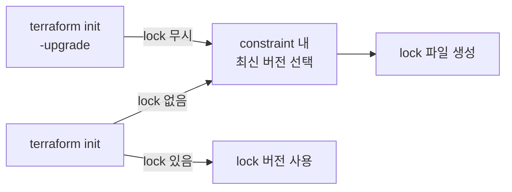

Ch02에서 `required_providers`로 Provider를 선언하고 `.terraform.lock.hcl`이 버전을 고정하는 것을 학습했다. 이번 섹션에서는 lock 파일의 내부 구조와 해시 메커니즘, 팀 환경에서의 버전 관리 전략을 다룬다.

# 버전 제약 심화

Ch02에서 학습한 `~>` 연산자의 동작을 정확히 구분한다.

## 1. 2-part와 3-part의 차이

`~>`는 **가장 오른쪽 버전 컴포넌트만 증가를 허용**한다.

| Constraint | 허용 범위 | 의미 |
|------------|----------|------|
| `~> 6.0` | `>= 6.0, < 7.0` | minor 증가 허용 |
| `~> 6.1` | `>= 6.1, < 7.0` | minor 증가 허용, 하한이 6.1 |
| `~> 6.1.0` | `>= 6.1.0, < 6.2.0` | patch만 허용 |

2-part(`~> 6.0`)는 6.x 전체를 허용하지만 3-part(`~> 6.1.0`)는 6.1.x만 허용한다. 이 시리즈에서 사용하는 `~> 6.0`은 AWS Provider 6.x 전체를 허용하되 7.0은 차단한다.

## 2. 제약 조합

쉼표로 여러 조건을 결합하면 모든 조건을 동시에 만족하는 버전만 허용한다.

```hcl
version = ">= 6.0.0, < 7.0.0"    # ~> 6.0과 동일한 효과
version = ">= 6.10, != 6.15.0"   # 6.10 이상이되 6.15.0은 제외
```

실무에서는 `~>` 하나로 충분한 경우가 대부분이다. 특정 버전에 버그가 있어서 제외해야 할 때 `!=`을 조합한다.

---

# Lock 파일 (Dependency Lock)

## 1. 동작 원리

`terraform init`이 Provider를 설치할 때 선택한 버전과 해시를 `.terraform.lock.hcl`에 기록한다.



lock 파일이 있으면 constraint 범위 내에 더 새로운 버전이 있어도 무시한다. `~> 6.0`으로 설정하고 lock에 `6.40.0`이 기록되어 있으면, `6.41.0`이 릴리즈되어도 `6.40.0`을 계속 사용한다. 이것이 lock 파일의 핵심 가치다.

`-upgrade` 플래그를 명시하면 lock 파일을 무시하고 constraint 내 최신 버전으로 업데이트한다. lock 파일이 재작성된다.

## 2. 내부 구조

`.terraform.lock.hcl`을 열어보면 provider 별로 다음 정보가 기록되어 있다.

```hcl
provider "registry.terraform.io/hashicorp/aws" {
  version     = "6.40.0"
  constraints = "~> 6.0"
  hashes = [
    "h1:xxxxxxxxxxxxxxxxxxxxxxxxxxxxxxxxxxxxxxxxxxxxxxxx",
    "zh:xxxxxxxxxxxxxxxxxxxxxxxxxxxxxxxxxxxxxxxxxxxxxxxx",
    "zh:xxxxxxxxxxxxxxxxxxxxxxxxxxxxxxxxxxxxxxxxxxxxxxxx",
    ...
  ]
}
```

| 항목 | 의미 |
|------|------|
| version | 실제로 설치된 정확한 버전 |
| constraints | 이 버전을 선택할 때 적용된 제약 조건 |
| hashes | 패키지 무결성 검증용 체크섬 |

### ① Provider만 추적한다

lock 파일은 Module 버전을 추적하지 않는다. `terraform init`은 항상 constraint 내 최신 Module 버전을 선택한다. Module의 정확한 버전을 고정하려면 exact version constraint를 사용해야 한다.

### ② Hash 형식

hashes 배열에 두 종류의 해시가 포함된다.

| 형식 | 이름 | 대상 |
|------|------|------|
| `h1:` | Hash Scheme 1 | 패키지 **내용물**의 SHA256 |
| `zh:` | Zip Hash | Registry `.zip` 파일의 SHA256 |

Registry에서 처음 설치하면 `zh:` 해시가 모든 플랫폼에 대해 포함되고, `h1:` 해시는 **현재 플랫폼 것만** 포함된다. macOS에서 init하면 `darwin_arm64`의 `h1:` 해시만 기록된다. 이것이 팀 환경에서 문제가 된다.

### ③ constraint 불일치

`required_providers`의 constraint를 변경했는데 lock 파일의 버전이 새 constraint를 만족하지 못하면 `terraform init`이 실패한다.

```hcl
# 기존: ~> 6.0 → lock에 6.40.0 기록
# 변경: ~> 6.41 → lock의 6.40.0이 새 constraint 범위 밖
```

이 경우 `terraform init -upgrade`로 새 constraint에 맞는 버전을 선택해야 한다.

## 3. 실무 관점

### ① VCS에 커밋하는 이유

`.terraform.lock.hcl`은 반드시 VCS에 커밋한다.

| 커밋하는 것 | 커밋하지 않는 것 |
|------------|----------------|
| `.terraform.lock.hcl` | `.terraform/` 디렉토리 |
| 버전 + 해시 정보 (텍스트) | Provider 바이너리 (수백 MB) |

lock 파일을 커밋하면 팀 전체가 동일한 Provider 버전을 사용한다. 개발자 A가 6.40.0으로 작성한 코드를 개발자 B가 6.41.0으로 실행해서 발생하는 미묘한 차이를 방지한다. `-upgrade`로 버전을 올리면 lock 파일이 바뀌고, 이 변경이 PR에 포함되어 code review 대상이 된다.

### ② 크로스 플랫폼 해시 문제

macOS(`darwin_arm64`)에서 `terraform init`을 실행하면 `h1:` 해시가 macOS 플랫폼 것만 기록된다. 이 lock 파일을 커밋하고 CI/CD(`linux_amd64`)에서 `terraform init`을 실행하면 해시 불일치로 실패할 수 있다.

`terraform providers lock` 명령으로 해결한다.

```bash
$ terraform providers lock \
    -platform=linux_amd64 \
    -platform=darwin_amd64 \
    -platform=darwin_arm64
```

모든 대상 플랫폼의 `h1:` 해시를 미리 계산해서 lock 파일에 기록한다. 이 명령을 실행한 후 lock 파일을 커밋하면 어떤 플랫폼에서든 `terraform init`이 성공한다.

실행 시점: Provider 버전을 변경할 때(`-upgrade` 후), 새 Provider를 추가할 때, 팀에 새로운 OS 사용자가 합류할 때 실행한다. 일상적인 `terraform init`에서는 필요 없다.

### ③ Plugin Cache

같은 Provider를 여러 프로젝트에서 사용하면 매번 다운로드하는 대신 로컬에 캐시할 수 있다.

```bash
# 환경 변수로 설정
export TF_PLUGIN_CACHE_DIR="$HOME/.terraform.d/plugin-cache"
```

또는 CLI 설정 파일(`~/.terraformrc`)에 지정한다.

```hcl
plugin_cache_dir = "$HOME/.terraform.d/plugin-cache"
```

캐시 디렉토리는 미리 생성해야 한다. `terraform init` 실행 시 캐시를 먼저 확인하고, 있으면 복사해서 사용한다. 오래된 버전이 자동으로 정리되지 않으므로 디스크 공간이 부족하면 수동 삭제가 필요하다.

---

# 핵심 정리

- `~>` 연산자: 2-part(`~> 6.0`)는 minor 허용, 3-part(`~> 6.1.0`)는 patch만 허용
- lock 파일은 Provider만 추적한다. Module은 추적하지 않는다
- lock 파일이 있으면 `terraform init`은 lock 버전을 사용한다. 최신 버전이 있어도 무시한다
- `-upgrade`는 의도적으로 실행한다. lock 파일 변경은 code review 대상이다
- lock 파일은 VCS에 커밋한다. `.terraform/` 디렉토리는 커밋하지 않는다
- 크로스 플랫폼 팀에서는 `terraform providers lock -platform=...`으로 해시를 미리 기록한다
- `TF_PLUGIN_CACHE_DIR`로 Provider 바이너리를 캐싱할 수 있다

다음 섹션에서 `alias`를 활용한 멀티 리전 Provider 구성을 다룬다.

---

# 참고 자료

- [Provider Requirements — Terraform 공식 문서](https://developer.hashicorp.com/terraform/language/providers/requirements)
- [Version Constraints — Terraform 공식 문서](https://developer.hashicorp.com/terraform/language/expressions/version-constraints)
- [Dependency Lock File — Terraform 공식 문서](https://developer.hashicorp.com/terraform/language/files/dependency-lock)
- [terraform init — Terraform 공식 문서](https://developer.hashicorp.com/terraform/cli/commands/init)
- [terraform providers lock — Terraform 공식 문서](https://developer.hashicorp.com/terraform/cli/commands/providers/lock)
