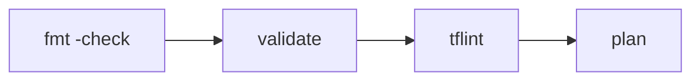

Terraform 코드를 작성하고 apply하는 것만으로는 코드 품질을 보장할 수 없다. 이번 섹션에서는 코드 품질의 첫 번째 방어선인 세 가지 도구를 학습한다. 포맷팅(`fmt`), 문법 검증(`validate`), 정적 분석(`tflint`)이 각각 무엇을 검사하고 어떤 순서로 사용하는지 이해한다.

# 세 가지 코드 품질 도구

## 1. 역할 비교

| | `terraform fmt` | `terraform validate` | `tflint` |
|--|-----------------|---------------------|----------|
| 목적 | HCL 포맷 정렬 | 문법 + 스키마 검증 | 린팅 + 베스트 프랙티스 |
| 포맷 검사 | ✓ | | |
| 문법/참조 검사 | | ✓ | ✓ (제한적) |
| 값 유효성 검사 | | | ✓ |
| `terraform init` 필요 | | ✓ | |
| AWS 자격증명 필요 | | | |
| 파일 수정 | ✓ (기본) | | |

세 도구는 겹치지 않는다. `fmt`는 코드 모양을 정리하고, `validate`는 코드가 문법적으로 올바른지 확인하고, `tflint`은 값이 실제로 유효한지 검사한다.

## 2. CI/CD에서의 실행 순서



빠르고 가벼운 도구부터 실행한다. `fmt`는 init 없이 실행 가능하고, `validate`는 init이 필요하지만 API 호출은 없다. `tflint`은 자체 플러그인으로 동작한다. 세 도구가 모두 통과한 후에 `plan`을 실행한다.

---

# terraform fmt

## 1. 동작 원리

HCL 표준 포맷(canonical format)으로 코드를 재작성한다. 들여쓰기, 정렬, 공백을 통일한다. 코드의 의미는 변경하지 않는다.

```bash
$ terraform fmt

# 출력 예
main.tf
variables.tf
```

변경된 파일 이름이 출력된다. 변경이 없으면 출력이 없다.

## 2. 주요 플래그

| 플래그 | 동작 |
|--------|------|
| `-recursive` | 하위 디렉토리까지 포맷 |
| `-check` | 수정하지 않고 검사만. exit 0 = 정상, exit 3 = 포맷 필요 |
| `-diff` | 변경 내용을 diff로 표시 |

### ① 일상 사용

```bash
$ terraform fmt -recursive
```

프로젝트 전체의 `.tf` 파일을 한 번에 정렬한다.

### ② CI에서 사용

```bash
$ terraform fmt -recursive -check

# 출력 예 (포맷 필요 시)
main.tf
variables.tf

$ echo $?
3
```

`-check`는 파일을 수정하지 않고 검사만 한다. 포맷이 필요한 파일이 있으면 exit code 3을 반환한다. CI에서 이 exit code로 빌드를 실패시킨다.

## 3. 주의사항

- `fmt`는 문법 검증을 하지 않는다. 문법 오류가 있는 코드도 포맷할 수 있다
- 커스터마이즈 옵션이 없다. 의도적으로 하나의 스타일만 강제한다
- Terraform 버전 업그레이드 후 포맷 규칙이 바뀔 수 있다. 업그레이드 후 `fmt`를 재실행하면 된다

---

# terraform validate

## 1. 동작 원리

코드의 문법적 정합성을 검사한다. 참조가 유효한지, 타입이 맞는지, 블록 구조가 올바른지 확인한다. 실제 AWS API를 호출하지 않으므로 자격증명이 필요 없다.

```bash
$ terraform validate

# 출력 예 (성공)
Success! The configuration is valid.
```

```bash
$ terraform validate

# 출력 예 (실패)
╷
│ Error: Reference to undeclared input variable
│
│   on main.tf line 5, in resource "aws_instance" "web":
│    5:   instance_type = var.type
│
│ An input variable with the name "type" has not been declared.
╵
```

## 2. 검사 범위

| 검사 항목 | 예시 |
|----------|------|
| 누락 variable | `var.type` 선언 안 됨 |
| 타입 불일치 | string 자리에 number |
| 잘못된 참조 | `local.undefined` |
| 알 수 없는 attribute | `aws_instance`에 `storage` 인수 |
| 중복 선언 | 같은 이름의 resource 2개 |

### ① init이 필수인 이유

`validate`는 provider schema를 참조해서 attribute 이름과 타입을 검사한다. schema는 `terraform init`이 다운로드하는 provider 바이너리에 포함되어 있다. init 없이 validate를 실행하면 에러가 발생한다.

backend 초기화 없이 validate만 하려면:

```bash
$ terraform init -backend=false
$ terraform validate
```

### ② JSON 출력

```bash
$ terraform validate -json
```

```json
{
  "valid": false,
  "error_count": 1,
  "warning_count": 0,
  "diagnostics": [
    {
      "severity": "error",
      "summary": "Reference to undeclared input variable",
      "detail": "An input variable with the name \"type\" has not been declared.",
      "range": {
        "filename": "main.tf",
        "start": { "line": 5, "column": 19 }
      }
    }
  ]
}
```

CI에서 validate 결과를 파싱할 때 사용한다.

---

# tflint

## 1. 동작 원리

`validate`가 문법과 스키마를 검사한다면, `tflint`은 **값의 유효성**과 **베스트 프랙티스**를 검사한다. 플러그인 기반이라 provider별 규칙을 추가할 수 있다.

```bash
$ tflint

# 출력 예
1 issue(s) found:

Warning: instance_type is not a valid value (aws_instance_invalid_type)

  on main.tf line 3:
   3:   instance_type = "t3.xxxlarge"
```

`validate`는 `instance_type`이 string이면 통과시킨다. `tflint`은 `"t3.xxxlarge"`가 AWS에 존재하지 않는 인스턴스 타입임을 잡아낸다.

## 2. 설치와 설정

```bash
# macOS
$ brew install tflint

# Linux
$ curl -s https://raw.githubusercontent.com/terraform-linters/tflint/master/install_linux.sh | bash
```

프로젝트 루트에 `.tflint.hcl` 설정 파일을 작성한다.

```hcl
plugin "terraform" {
  enabled = true
  preset  = "recommended"
}

plugin "aws" {
  enabled = true
  version = "0.47.0"
  source  = "github.com/terraform-linters/tflint-ruleset-aws"
}
```

플러그인을 다운로드한다.

```bash
$ tflint --init
```

## 3. AWS Ruleset이 잡는 것

| 규칙 | 예시 |
|------|------|
| 유효하지 않은 인스턴스 타입 | `"t3.xxxlarge"` |
| deprecated 리소스 | 지원 종료된 AWS 리소스 |
| 태그 누락 | 필수 태그가 없는 리소스 |
| 잘못된 attribute 값 | 지원하지 않는 AMI 형식 |

AWS Ruleset에 700개 이상의 규칙이 포함되어 있다. 대부분 기본 비활성화 상태이며, `.tflint.hcl`에서 개별 규칙을 활성화할 수 있다.

## 4. validate와의 차이

```hcl
resource "aws_instance" "web" {
  instance_type = "t3.xxxlarge"    # validate: OK (string이니까)
                                    # tflint:  Error (존재하지 않는 타입)
}
```

`validate`는 provider schema 기준으로 attribute 타입만 검사한다. `tflint`은 그 값이 실제로 유효한지까지 검사한다. `validate`를 통과한 코드가 `tflint`에서 실패할 수 있다.

---

# [실습] lab01: fmt & validate

의도적으로 포맷을 깨뜨리고 잘못된 참조를 넣어서 `fmt`와 `validate`의 동작을 확인한다.

### 실습 목표

- `terraform fmt`로 포맷 정렬 체험
- `terraform fmt -check`로 CI 스타일 체크 확인
- `terraform validate`로 참조 오류 재현 및 확인

---

# 1. 사전 준비

```text
lab01/
├── main.tf
├── variables.tf
└── providers.tf
```

---

# 2. 포맷 깨뜨리기

## main.tf

의도적으로 들여쓰기와 정렬을 깨뜨린다.

```hcl
resource "aws_security_group" "web" {
name = "tf-core-lab01-sg-web"

    ingress {
  from_port = 80
        to_port   = 80
    protocol    = "tcp"
  cidr_blocks = ["0.0.0.0/0"]
    }
}
```

---

# 3. terraform fmt

```bash
$ terraform fmt

# 출력 예
main.tf
```

`main.tf`가 표시되면 포맷이 수정된 것이다. 파일을 다시 열면 정렬이 정리되어 있다.

```bash
$ terraform fmt -check

# 출력 예 (이미 정렬됨)
$ echo $?
0
```

이미 정렬된 상태에서 `-check`를 실행하면 exit code 0이 반환된다.

포맷을 다시 깨뜨린 후:

```bash
$ terraform fmt -check

# 출력 예
main.tf

$ echo $?
3
```

exit code 3은 포맷이 필요한 파일이 있다는 의미다. CI에서 이 값으로 빌드를 실패시킨다.

---

# 4. 참조 오류 만들기

`main.tf`를 수정해서 존재하지 않는 variable을 참조한다.

```hcl
resource "aws_security_group" "web" {
  name = "tf-core-lab01-sg-web"

  ingress {
    from_port   = var.service_port
    to_port     = var.service_port
    protocol    = "tcp"
    cidr_blocks = var.nonexistent_var
  }
}
```

`var.nonexistent_var`는 `variables.tf`에 선언되지 않은 variable이다.

---

# 5. terraform validate

```bash
$ terraform init -backend=false
$ terraform validate

# 출력 예
╷
│ Error: Reference to undeclared input variable
│
│   on main.tf line 8, in resource "aws_security_group" "web":
│    8:     cidr_blocks = var.nonexistent_var
│
│ An input variable with the name "nonexistent_var" has not been declared.
╵
```

`validate`가 `var.nonexistent_var`를 잡아낸다. `fmt`는 이 오류를 잡지 못한다. 포맷은 정상이지만 코드가 유효하지 않은 상태다.

오류를 수정하고 다시 validate한다.

```bash
$ terraform validate

# 출력 예
Success! The configuration is valid.
```

---

# 6. terraform destroy

이 lab은 리소스를 생성하지 않으므로 destroy가 필요 없다.

---

# [실습] lab02: tflint 설치 및 실행

tflint을 설치하고 AWS Ruleset으로 `validate`가 잡지 못하는 오류를 탐지한다.

### 실습 목표

- tflint 설치 및 AWS Ruleset 초기화
- 잘못된 `instance_type`을 `validate`와 `tflint`로 각각 검사
- `.tflint.hcl` 설정 파일 작성

---

# 1. 사전 준비

```text
lab02/
├── main.tf
├── variables.tf
├── providers.tf
└── .tflint.hcl
```

---

# 2. tflint 설치

```bash
# macOS
$ brew install tflint

# 설치 확인
$ tflint --version

# 출력 예
TFLint version 0.62.0
```

---

# 3. .tflint.hcl

```hcl
plugin "terraform" {
  enabled = true
  preset  = "recommended"
}

plugin "aws" {
  enabled = true
  version = "0.47.0"
  source  = "github.com/terraform-linters/tflint-ruleset-aws"
}
```

플러그인을 다운로드한다.

```bash
$ tflint --init

# 출력 예
Installing "aws" plugin...
Installed "aws" (source: github.com/terraform-linters/tflint-ruleset-aws, version: 0.47.0)
```

---

# 4. 잘못된 instance_type

## main.tf

```hcl
resource "aws_instance" "web" {
  ami           = "ami-0c003e98ceffee43e"
  instance_type = "t3.xxxlarge"

  tags = {
    Name = "tf-core-lab02-instance-web"
  }
}
```

`"t3.xxxlarge"`는 AWS에 존재하지 않는 인스턴스 타입이다.

---

# 5. validate vs tflint

```bash
$ terraform init -backend=false
$ terraform validate

# 출력 예
Success! The configuration is valid.
```

`validate`는 `instance_type`이 string이므로 통과시킨다.

```bash
$ tflint

# 출력 예
1 issue(s) found:

Warning: instance_type is not a valid value (aws_instance_invalid_type)

  on main.tf line 3:
   3:   instance_type = "t3.xxxlarge"

Reference: https://github.com/terraform-linters/tflint-ruleset-aws/blob/v0.47.0/docs/rules/aws_instance_invalid_type.md
```

`tflint`이 `"t3.xxxlarge"`가 유효하지 않은 인스턴스 타입임을 잡아낸다.

`instance_type`을 `"t3.small"`로 수정하고 다시 실행한다.

```bash
$ tflint

# 출력 예 (이슈 없음)
```

---

# 6. terraform destroy

이 lab도 리소스를 생성하지 않으므로 destroy가 필요 없다.

---

# 핵심 정리

- `terraform fmt`는 코드 포맷만 정렬한다. 문법이나 값은 검사하지 않는다
- `terraform validate`는 문법, 참조, 타입, provider schema를 검사한다. 값의 유효성은 검사하지 않는다
- `tflint`은 값의 유효성과 베스트 프랙티스를 검사한다. provider별 플러그인으로 확장한다
- CI/CD에서는 `fmt -check` → `validate` → `tflint` → `plan` 순서로 실행한다
- `fmt -check`의 exit code 3으로 포맷 미준수를 CI에서 차단한다
- `validate`는 `terraform init`이 필수다. backend 없이 하려면 `init -backend=false`를 사용한다

다음 섹션에서 `precondition`, `postcondition`, `check` 블록으로 런타임 검증을 다룬다.

---

# 참고 자료

- [terraform fmt — Terraform 공식 문서](https://developer.hashicorp.com/terraform/cli/commands/fmt)
- [terraform validate — Terraform 공식 문서](https://developer.hashicorp.com/terraform/cli/commands/validate)
- [tflint — GitHub](https://github.com/terraform-linters/tflint)
- [tflint-ruleset-aws — GitHub](https://github.com/terraform-linters/tflint-ruleset-aws)
