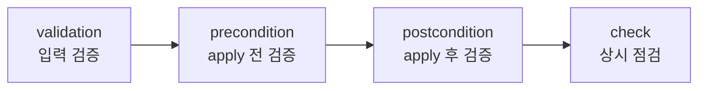

Ch02에서 variable `validation`으로 입력값을 검증했다. 이번 섹션에서는 Terraform이 제공하는 네 가지 검증 메커니즘을 전체적으로 학습한다. 입력 단계부터 배포 후 상시 점검까지, 각 메커니즘이 어떤 시점에 무엇을 검증하는지 이해한다.

# 네 가지 검증 메커니즘

## 1. 실행 순서



| 단계 | 메커니즘 | 실행 시점 | 실패 시 |
|------|---------|----------|--------|
| 1 | `validation` | input 처리 (plan 이전) | error — 즉시 중단 |
| 2 | `precondition` | plan 후, apply 전 | error — 즉시 중단 |
| 3 | `postcondition` | apply 후 | error — 즉시 중단 |
| 4 | `check` | plan/apply 마지막 | **warning — 비차단** |

앞의 세 개는 실패 시 전체를 중단한다. `check`만 warning으로 처리하고 apply를 막지 않는다.

## 2. 비교

| | validation | precondition | postcondition | check |
|---|---|---|---|---|
| 위치 | `variable {}` 내부 | `lifecycle {}` 내부 | `lifecycle {}` 내부 | top-level 블록 |
| 참조 범위 | 자기 변수 (TF 1.9+: 다른 객체도 가능) | resource, var, local, data | `self` (리소스 결과 속성) | resource, var, data, output |
| `self` 사용 | 불가 | 불가 | 가능 | 불가 |
| scoped data | 불가 | 불가 | 불가 | 가능 |
| 용도 | 입력값 형식/범위 | apply 전 교차 조건 | 생성 결과 확인 | 상시 헬스 체크 |
| 최소 버전 | v0.13.0 | v1.2.0 (TF 1.2+) | v1.2.0 (TF 1.2+) | v1.5.0 (TF 1.5+) |

---

# validation 고급 패턴

Ch02에서 `contains()`, `length()` 기반 validation을 학습했다. 여기서는 `can()` 함수와 `regex()`를 활용한 고급 패턴을 다룬다.

## 1. can() 함수

`can()`은 표현식을 평가하고 에러 없이 성공하면 `true`, 에러가 발생하면 `false`를 반환한다.

```hcl
variable "image_id" {
  type = string

  validation {
    condition     = can(regex("^ami-", var.image_id))
    error_message = "image_id는 \"ami-\"로 시작해야 한다."
  }
}
```

`regex()`가 매칭에 실패하면 에러를 발생시키는데, `can()`이 이 에러를 `false`로 변환한다.

## 2. CIDR 검증

```hcl
variable "vpc_cidr" {
  type = string

  validation {
    condition     = can(cidrhost(var.vpc_cidr, 0))
    error_message = "vpc_cidr은 유효한 CIDR 표기법이어야 한다."
  }
}
```

`cidrhost()`가 잘못된 CIDR에서 에러를 발생시키면 `can()`이 `false`를 반환한다.

## 3. 복수 validation 블록

하나의 variable에 여러 validation 블록을 선언할 수 있다. 각 블록이 독립적으로 검사하므로 에러 메시지가 구체적이다.

```hcl
variable "env" {
  type = string

  validation {
    condition     = contains(["dev", "stg", "prod"], var.env)
    error_message = "env는 dev, stg, prod 중 하나여야 한다."
  }

  validation {
    condition     = length(var.env) <= 4
    error_message = "env는 4자 이하여야 한다."
  }
}
```

---

# precondition

## 1. 동작 원리

resource가 생성/변경되기 **전에** 조건을 검사한다. `lifecycle {}` 블록 안에 선언한다.

```hcl
resource "aws_instance" "web" {
  ami           = data.aws_ami.amazon_linux.id
  instance_type = var.instance_type

  lifecycle {
    precondition {
      condition     = data.aws_ami.amazon_linux.architecture == "x86_64"
      error_message = "AMI는 x86_64 아키텍처여야 한다."
    }
  }
}
```

## 2. validation과의 차이

validation은 자기 변수만 검증한다. precondition은 **여러 값을 조합**해서 교차 검증할 수 있다. data source의 결과, 다른 resource의 속성, local 값을 모두 참조할 수 있다.

```hcl
# validation으로는 불가능한 교차 검증
lifecycle {
  precondition {
    condition     = var.instance_type != "t3.micro" || var.env != "prod"
    error_message = "prod 환경에서 t3.micro는 사용할 수 없다."
  }
}
```

## 3. output에서의 precondition

output 블록에서는 `lifecycle {}` 없이 직접 선언한다.

```hcl
output "instance_public_ip" {
  value = aws_instance.web.public_ip

  precondition {
    condition     = aws_instance.web.associate_public_ip_address
    error_message = "인스턴스에 public IP가 활성화되어야 한다."
  }
}
```

---

# postcondition

## 1. 동작 원리

resource가 생성/변경된 **후에** 결과를 검증한다. `self`로 해당 리소스의 결과 속성에 접근할 수 있다.

```hcl
resource "aws_instance" "web" {
  ami                         = data.aws_ami.amazon_linux.id
  instance_type               = var.instance_type
  associate_public_ip_address = true

  lifecycle {
    postcondition {
      condition     = self.public_ip != ""
      error_message = "인스턴스에 public IP가 할당되지 않았다."
    }
  }
}
```

## 2. self 참조

postcondition의 핵심 기능이다. `self.public_ip`, `self.id`, `self.arn` 등 리소스가 생성된 후의 실제 값을 검증한다. precondition에서는 `self`를 사용할 수 없다. 아직 리소스가 생성되기 전이기 때문이다.

## 3. 실패 시 동작

postcondition이 실패하면 해당 리소스는 이미 생성된 상태다. 하지만 Terraform은 에러를 발생시키고 **후속 리소스의 apply를 차단**한다. 잘못된 리소스가 다른 리소스로 전파되는 것을 방지한다.

---

# check 블록

## 1. 동작 원리 (TF 1.5+)

top-level 독립 블록으로, plan/apply의 마지막 단계에서 실행된다. **실패해도 warning만 출력**하고 apply를 막지 않는다.

```hcl
check "gallery_health" {
  data "http" "app" {
    url = "http://${aws_lb.this.dns_name}/actuator/health"
  }

  assert {
    condition     = data.http.app.status_code == 200
    error_message = "Gallery 앱이 정상 응답하지 않는다."
  }
}
```

## 2. scoped data source

check 블록 안에 선언한 data source는 **해당 블록에서만** 접근 가능하다. 블록 바깥의 다른 resource나 output에서 참조할 수 없다. 이 data source의 실패도 warning으로 처리된다.

## 3. data source 없이 사용

기존 리소스를 직접 assert할 수도 있다.

```hcl
check "instance_has_public_ip" {
  assert {
    condition     = aws_instance.web.public_ip != ""
    error_message = "인스턴스에 public IP가 없다."
  }
}
```

## 4. 복수 assert

하나의 check 블록에 여러 assert를 선언할 수 있다.

```hcl
check "gallery_status" {
  data "http" "app" {
    url = "http://${aws_lb.this.dns_name}/actuator/health"
  }

  assert {
    condition     = data.http.app.status_code == 200
    error_message = "HTTP 응답이 200이 아니다."
  }

  assert {
    condition     = jsondecode(data.http.app.response_body).status == "UP"
    error_message = "앱 상태가 UP이 아니다."
  }
}
```

---

# [실습] lab01: precondition / postcondition

EC2 인스턴스에 precondition과 postcondition을 적용해서 배포 전후 검증을 체험한다.

### 실습 목표

- precondition으로 AMI 아키텍처 검증 (apply 전)
- postcondition으로 public IP 할당 검증 (apply 후)
- 조건 실패 시 에러 메시지 확인

---

# 1. 사전 준비

```text
lab01/
├── main.tf
├── variables.tf
├── datasources.tf
└── providers.tf
```

---

# 2. main.tf

```hcl
resource "aws_instance" "web" {
  ami                         = data.aws_ami.amazon_linux.id
  instance_type               = var.instance_type
  associate_public_ip_address = true

  lifecycle {
    precondition {
      condition     = data.aws_ami.amazon_linux.architecture == "x86_64"
      error_message = "AMI는 x86_64 아키텍처여야 한다."
    }

    postcondition {
      condition     = self.public_ip != ""
      error_message = "인스턴스에 public IP가 할당되지 않았다."
    }
  }

  tags = {
    Name = "tf-core-lab01-instance-web"
  }
}
```

precondition은 AMI 아키텍처를 검사한다. `data.aws_ami`의 결과가 `x86_64`가 아니면 apply를 중단한다. postcondition은 인스턴스 생성 후 `self.public_ip`가 비어있지 않은지 확인한다.

---

# 3. terraform apply

```bash
$ terraform init && terraform apply
```

```text
...(생략)...

Apply complete! Resources: 1 added, 0 changed, 0 destroyed.
```

AMI가 x86_64이고 public IP가 할당되면 정상 완료된다.

---

# 4. precondition 실패 재현

datasources.tf에서 AMI 필터를 ARM 아키텍처로 변경한다.

```hcl
data "aws_ami" "amazon_linux" {
  most_recent = true

  filter {
    name   = "name"
    values = ["al2023-ami-2023.*-arm64"]
  }

  owners = ["amazon"]
}
```

```bash
$ terraform plan

# 출력 예
╷
│ Error: Resource precondition failed
│
│   on main.tf line 8, in resource "aws_instance" "web":
│    8:       condition     = data.aws_ami.amazon_linux.architecture == "x86_64"
│
│ AMI는 x86_64 아키텍처여야 한다.
╵
```

plan 단계에서 차단된다. apply까지 가지 않는다.

---

# 5. terraform destroy

```bash
$ terraform destroy
```

---

# [실습] lab02: check 블록

`check` 블록으로 EC2의 HTTP 응답을 상시 점검한다.

### 실습 목표

- `check` 블록 + `http` data source로 헬스 체크
- check 실패가 warning이고 apply를 막지 않음을 확인

---

# 1. 사전 준비

```text
lab02/
├── main.tf
├── variables.tf
├── datasources.tf
└── providers.tf
```

---

# 2. main.tf

```hcl
resource "aws_security_group" "web" {
  name = "tf-core-lab02-sg-web"

  ingress {
    from_port   = 80
    to_port     = 80
    protocol    = "tcp"
    cidr_blocks = ["0.0.0.0/0"]
  }

  egress {
    from_port   = 0
    to_port     = 0
    protocol    = "-1"
    cidr_blocks = ["0.0.0.0/0"]
  }

  tags = {
    Name = "tf-core-lab02-sg-web"
  }
}

resource "aws_instance" "web" {
  ami                         = data.aws_ami.amazon_linux.id
  instance_type               = "t3.micro"
  associate_public_ip_address = true
  vpc_security_group_ids      = [aws_security_group.web.id]

  tags = {
    Name = "tf-core-lab02-instance-web"
  }
}

check "web_health" {
  data "http" "app" {
    url = "http://${aws_instance.web.public_ip}"
  }

  assert {
    condition     = data.http.app.status_code == 200
    error_message = "${data.http.app.url}이 정상 응답하지 않는다."
  }
}
```

---

# 3. terraform apply

```bash
$ terraform init && terraform apply
```

```text
...(생략)...

Apply complete! Resources: 2 added, 0 changed, 0 destroyed.

╷
│ Warning: Check block assertion failed
│
│   on main.tf line 38, in check "web_health":
│   38:     condition     = data.http.app.status_code == 200
│
│ http://13.xxx.xxx.xxx이 정상 응답하지 않는다.
╵
```

리소스 2개가 정상 생성된다. check 실패는 **warning**이다. apply를 막지 않는다. 인스턴스에 웹 서버가 없으므로 HTTP 응답이 실패하는 것이 정상이다.

---

# 4. warning과 error의 차이

precondition/postcondition이 실패하면 **error**가 발생하고 apply가 중단된다. check가 실패하면 **warning**만 출력되고 apply는 완료된다. check는 "이 상태가 바람직한가?"를 알려주는 것이지 "이 상태가 되면 안 된다"를 강제하는 것이 아니다.

---

# 5. terraform destroy

```bash
$ terraform destroy
```

---

# 핵심 정리

- Terraform은 네 가지 검증 메커니즘을 제공한다: `validation`, `precondition`, `postcondition`, `check`
- 실행 순서: validation(입력) → precondition(apply 전) → postcondition(apply 후) → check(마지막)
- validation, precondition, postcondition은 실패 시 error(중단). check만 warning(비차단)
- precondition은 여러 값을 교차 검증할 수 있다. validation은 자기 변수에 제한된다 (TF 1.9+ 이전)
- postcondition은 `self`로 리소스 결과를 검증한다. precondition에서는 `self`를 사용할 수 없다
- check 블록의 scoped data source는 블록 내부에서만 접근 가능하다

다음 섹션(Gallery)에서 `check` 블록을 Gallery 앱의 상시 헬스 체크에 적용한다.

---

# 참고 자료

- [Custom Conditions — Terraform 공식 문서](https://developer.hashicorp.com/terraform/language/expressions/custom-conditions)
- [Checks — Terraform 공식 문서](https://developer.hashicorp.com/terraform/language/checks)
- [Variable Validation — Terraform 공식 문서](https://developer.hashicorp.com/terraform/language/values/variables#custom-validation-rules)
- [can() Function — Terraform 공식 문서](https://developer.hashicorp.com/terraform/language/functions/can)
