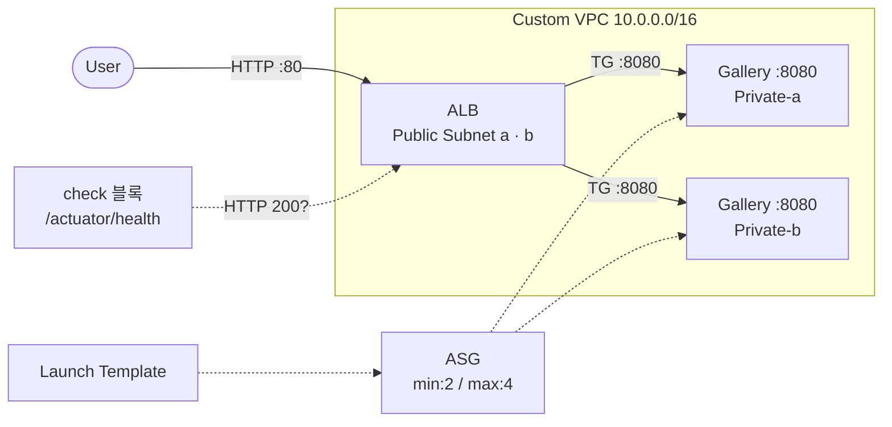

09.02에서 `check` 블록의 동작을 학습했다. 이번 Gallery에서는 Ch05 Gallery(ALB + ASG)에 `check` 블록을 추가해서 Gallery 앱의 HTTP 응답을 상시 점검한다.

| Chapter | Gallery 실습 | 핵심 변화 |
|---------|------------|----------|
| Ch02 | EC2 기본 배포 | 수동 설치 (SSM 접속). Local State |
| Ch04 | user_data 자동화 + Remote Backend | user_data + systemd. S3 Remote State |
| Ch05 | ALB + ASG | 3-Layer 모듈, Launch Template + ASG. `ALB:80` |
| Ch07 | dev/prod 환경 분리 | 디렉토리 기반 분리. envs/dev, envs/prod |
| **Ch09** | **검증 추가** | **`check` 블록으로 상시 헬스 체크** |

### 실습 목표

- Ch05 Gallery에 `check` 블록을 추가한다
- ALB endpoint + `/actuator/health` 경로로 HTTP 응답을 검증한다
- `check` 실패가 warning이고 apply를 막지 않음을 확인한다
- `terraform plan`에서도 check가 실행됨을 확인한다

---

# 1. 전체 아키텍처



Ch05 Gallery와 동일한 인프라다. 추가되는 것은 `check` 블록 하나뿐이다. `check` 블록이 ALB endpoint의 `/actuator/health` 경로를 `http` data source로 조회하고, HTTP 200 응답을 assert한다.

---

# 2. 사전 준비

- Ch05 Gallery(05.03) 완료
- Ch09 Sec02 완료 (check 블록 학습)
- S3 tfstate 버킷 존재 (`tf-core-tfstate`)

**Ch05 Gallery 코드를 복사해 시작한다.**

```bash
$ cp -r "05 모듈/03 [실습] Gallery: 인프라 모듈화/." "09 코드 품질 & 배포 자동화/03 [실습] Gallery: 검증 추가/"
```

`modules/` 디렉토리를 포함해 복사한다.

**디렉토리 구조:**

```text
Gallery - 검증 추가/
├── main.tf            ← check 블록 추가
├── locals.tf
├── variables.tf
├── providers.tf
├── outputs.tf
└── modules/
    ├── network/       ← 변경 없음
    ├── platform/      ← 변경 없음
    └── workload/      ← 변경 없음
```

모듈은 변경하지 않는다. root `main.tf`에 `check` 블록만 추가한다.

---

# 3. check 블록 추가

## main.tf

Ch05 Gallery의 `main.tf`에 `check` 블록을 추가한다. 기존 module 블록은 그대로 유지한다.

```hcl
module "network" {
  source = "./modules/network"

  namespace = local.namespace
}

module "platform" {
  source = "./modules/platform"

  namespace = local.namespace

  vpc_id = module.network.vpc.id

  lb_subnets           = [module.network.subnet["public-a"].id, module.network.subnet["public-b"].id]
  lb_listener_port     = local.infra.lb.listener_port
  lb_target_group_port = local.infra.instance.service_port
}

module "workload" {
  source = "./modules/workload"

  namespace   = local.namespace
  environment = local.environment

  vpc_id = module.network.vpc.id

  asg_vpc_zone_identifier = [module.network.subnet["private-a"].id, module.network.subnet["private-b"].id]
  asg_target_group_arns   = [module.platform.lb.target_group.arn]
  asg_deploy_version      = local.infra.instance.deploy_version

  lt_service_port              = local.infra.instance.service_port
  lt_allow_access_cidr_blocks  = [module.network.subnet["public-a"].cidr_block, module.network.subnet["public-b"].cidr_block]
  lt_iam_instance_profile_name = module.platform.iamprofile.name
}

check "gallery_health" {
  data "http" "app" {
    url = "http://${module.platform.lb.dns_name}/actuator/health"
  }

  assert {
    condition     = data.http.app.status_code == 200
    error_message = "Gallery 앱이 정상 응답하지 않는다: ${data.http.app.url}"
  }

  assert {
    condition     = jsondecode(data.http.app.response_body).status == "UP"
    error_message = "Gallery 앱 상태가 UP이 아니다."
  }
}
```

### ① check 블록 구조

- `data "http" "app"`: ALB endpoint의 `/actuator/health` 경로를 조회한다. 이 data source는 check 블록 안에 선언된 **scoped data source**로, 블록 바깥에서 참조할 수 없다
- 첫 번째 `assert`: HTTP 상태 코드가 200인지 확인한다
- 두 번째 `assert`: 응답 body를 JSON으로 파싱해서 `status`가 `"UP"`인지 확인한다. Spring Boot Actuator의 health endpoint는 `{"status":"UP"}` 형태로 응답한다

### ② warning 동작

`check` 블록은 실패해도 **warning**만 출력한다. apply를 막지 않는다. 첫 배포 시 인스턴스가 아직 올라오지 않았으면 check가 실패하지만 인프라 생성은 정상 완료된다.

---

# 4. 배포

```bash
$ terraform init && terraform apply
```

```text
...(생략)...

Apply complete! Resources: 26 added, 0 changed, 0 destroyed.

╷
│ Warning: Check block assertion failed
│
│   on main.tf line 42, in check "gallery_health":
│   42:     condition     = data.http.app.status_code == 200
│
│ Gallery 앱이 정상 응답하지 않는다: http://tf-core-gallery-dev-lb-main-xxxxxxxxxx.ap-northeast-2.elb.amazonaws.com/actuator/health
╵
```

리소스 26개가 정상 생성된다. check warning은 예상된 동작이다. 인스턴스의 user_data(JDK 설치 + Maven 빌드)가 아직 완료되지 않았기 때문이다.

---

# 5. 결과 확인

약 5분 후 user_data 실행이 완료되면 Gallery 앱이 응답한다.

## terraform plan (check 재실행)

```bash
$ terraform plan
```

```text
...(생략)...

No changes. Your infrastructure matches the configuration.

╷
│ Warning: Check block assertion known after apply
╵
```

또는 앱이 정상이면:

```text
No changes. Your infrastructure matches the configuration.
```

warning 없이 plan이 완료된다. `check` 블록은 **plan에서도 실행**된다. 인프라 변경이 없어도 헬스 체크는 매번 수행된다.

## Gallery 앱 접근

```bash
$ terraform output endpoint
```

브라우저에서 접속한다.

[콘솔화면: 브라우저 > http://{ALB DNS} > Gallery 앱 메인 화면]

**확인:**

- Gallery 앱 메인 페이지 로드 확인
- 하단 Instance ID로 ALB 분산 확인

## health endpoint 직접 확인

```bash
$ curl -s "http://$(terraform output -raw endpoint | sed 's|http://||')/actuator/health" | jq .
```

```json
{
  "status": "UP"
}
```

이 응답이 `check` 블록의 두 번째 assert가 검증하는 값이다.

---

# 6. 정리

```bash
$ terraform destroy
```

```text
Destroy complete! Resources: 26 destroyed.
```

---

# 핵심 정리

- Ch05 Gallery에 `check` 블록 하나만 추가했다. 모듈 코드는 변경하지 않았다
- `check` 블록은 plan/apply 마지막 단계에서 실행된다. 인프라 변경 없이 `plan`만 해도 헬스 체크가 수행된다
- 실패는 **warning**이다. 첫 배포 시 앱이 아직 올라오지 않은 상태에서도 인프라 생성은 완료된다
- scoped data source(`data "http"`)는 check 블록 안에서만 접근 가능하다
- Spring Boot Actuator의 `/actuator/health` endpoint로 앱 상태(`"UP"`)까지 검증한다

---

# 참고 자료

- [Checks — Terraform 공식 문서](https://developer.hashicorp.com/terraform/language/checks)
- [http Data Source — hashicorp/http Provider](https://registry.terraform.io/providers/hashicorp/http/latest/docs/data-sources/http)
