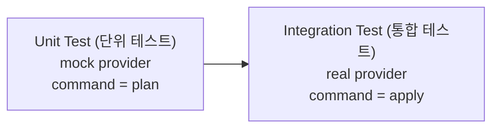
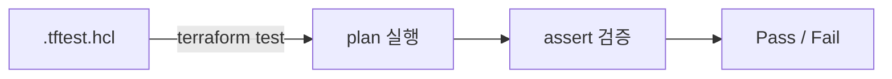
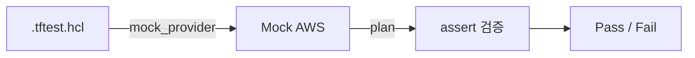

validation, precondition, postcondition, check — 네 가지 검증 메커니즘을 배웠다. 하지만 이 검증이 의도대로 동작하는지, 모듈이 올바른 리소스를 올바른 설정으로 생성하는지 어떻게 확인하는가? Terraform 1.6부터 `.tftest.hcl` 파일로 인프라 코드를 테스트할 수 있다.

# terraform test

## 1. 테스트가 필요한 이유

`terraform validate`는 문법과 참조 일관성만 검사한다. "이 변수가 존재하는가", "이 리소스 타입이 유효한가" 수준이다. 코드가 의도한 대로 인프라를 구성하는지는 확인하지 않는다.

`terraform test`는 plan 또는 apply를 실행한 후 결과를 assert로 검증한다.

| 비교 | `terraform validate` | `terraform test` |
|------|---------------------|-----------------|
| 검증 범위 | 문법 + 내부 일관성 | plan/apply 결과 검증 |
| Provider API 호출 | 하지 않음 | apply 시 실제 호출 (mock 가능) |
| 인프라 생성 | 하지 않음 | `command = apply` 시 실제 생성 |
| 용도 | CI 빠른 syntax check | 모듈 단위/통합 테스트 |

## 2. 테스트 유형



Unit test (단위 테스트)는 mock provider (모의 Provider)로 실제 AWS 호출 없이 HCL 로직을 검증한다. credential이 필요 없어 CI에서 빠르게 실행할 수 있다. Integration test (통합 테스트)는 실제 provider로 리소스를 생성하고 결과를 확인한다. 테스트 완료 후 Terraform이 자동으로 destroy한다.

---

# .tftest.hcl 파일

## 1. 파일 위치

테스트 파일은 두 곳에 배치할 수 있다.

| 위치 | 설명 |
|------|------|
| `tests/` 디렉토리 | 기본 테스트 디렉토리. `terraform test` 실행 시 자동 탐색 |
| 설정 루트 디렉토리 | `.tf` 파일과 같은 위치. 항상 로드됨 |

Terraform은 설정 루트의 `.tftest.hcl` 파일을 항상 로드하고, `tests/` 디렉토리도 함께 탐색한다. `-test-directory` 플래그로 디렉토리를 변경할 수 있다.

```text
lab01/
├── main.tf
├── locals.tf
├── variables.tf
├── outputs.tf
├── providers.tf
└── tests/
    ├── unit.tftest.hcl
    └── integration.tftest.hcl
```

## 2. 파일 구조

```hcl
# 파일 레벨 variables — 모든 run 블록에 적용
variables {
  instance_type = "t3.micro"
}

# run 블록 — 테스트 케이스
run "verify_instance_type" {
  command = plan

  assert {
    condition     = aws_instance.this.instance_type == "t3.micro"
    error_message = "instance_type이 t3.micro여야 한다."
  }
}
```

하나의 파일에 여러 `run` 블록을 선언할 수 있다. 기본적으로 선언 순서대로 순차 실행된다.

## 3. run 블록

| 속성 | 기본값 | 설명 |
|------|--------|------|
| `command` | `apply` | `plan` 또는 `apply` |
| `variables` | — | 이 run에서만 적용되는 variable override |
| `assert` | — | 검증 조건 (복수 가능) |
| `expect_failures` | — | 의도적 실패 대상 목록 |

### ① command

`command = plan`은 plan만 실행하고 실제 리소스를 생성하지 않는다. plan 결과에서 리소스 속성을 assert할 수 있다. `command = apply`는 실제로 리소스를 생성한다.

### ② assert

```hcl
assert {
  condition     = aws_instance.this.instance_type == "t3.micro"
  error_message = "Expected t3.micro, got ${aws_instance.this.instance_type}"
}
```

`condition`에서 resource 속성, output 값, data source 결과를 참조할 수 있다. `error_message`에서 문자열 보간을 지원한다. 하나의 run 블록에 여러 assert를 선언하면 모두 검증한다.

### ③ expect_failures — 네거티브 테스팅

validation, precondition, postcondition, check의 **의도적 실패**를 테스트한다.

```hcl
run "reject_invalid_type" {
  command = plan

  variables {
    instance_type = "invalid"
  }

  expect_failures = [
    var.instance_type,
  ]
}
```

`expect_failures`에 지정한 대상이 실패하면 테스트가 **성공**한다. 실패하지 않으면 테스트가 **실패**한다.

지원하는 대상:

| 대상 | 예시 |
|------|------|
| variable validation | `var.instance_type` |
| resource precondition/postcondition | `aws_instance.this` |
| output precondition | `output.public_ip` |
| check 블록 | `check.web_health` |

### ④ run 레벨 variables

파일 레벨 variables를 run 블록에서 override할 수 있다.

```hcl
variables {
  instance_type = "t3.micro"
}

run "default_type" {
  command = plan
  # instance_type = "t3.micro" (파일 레벨)
}

run "large_type" {
  command = plan

  variables {
    instance_type = "t3.large"    # 이 run에서만 override
  }
}
```

---

# mock provider (TF 1.7+)

## 1. 동작 원리

mock provider (모의 Provider)는 실제 API를 호출하지 않는다. credential이 필요 없다. 리소스의 computed 속성(id, arn 등)을 자동 생성하거나 직접 지정할 수 있다.

```hcl
mock_provider "aws" {}
```

이 한 줄로 AWS provider의 모든 resource와 data source가 mock된다.

## 2. 자동 생성 기본값

`mock_provider "aws" {}`만 선언하면 computed 속성에 타입별 기본값이 자동 할당된다.

| 타입 | 기본값 |
|------|--------|
| string | 랜덤 8자 영숫자 |
| number | `0` |
| boolean | `false` |
| list/set/map | 빈 컬렉션 |

## 3. mock_resource / mock_data

특정 리소스의 computed 속성 기본값을 직접 지정한다.

```hcl
mock_provider "aws" {
  mock_resource "aws_instance" {
    defaults = {
      id        = "i-mock12345678"
      public_ip = "1.2.3.4"
    }
  }

  mock_data "aws_ami" {
    defaults = {
      id           = "ami-mock12345678"
      architecture = "x86_64"
    }
  }
}
```

`defaults`에 지정한 값은 해당 타입의 모든 인스턴스에 적용된다.

## 4. Unit test vs Integration test

| 구분 | Unit test | Integration test |
|------|-----------|-----------------|
| provider | `mock_provider "aws" {}` | real provider |
| command | `plan` (주로) | `apply` |
| credential | 불필요 | 필요 |
| 인프라 생성 | 없음 | 있음 (자동 destroy) |
| 속도 | 빠름 | 느림 |
| 검증 범위 | HCL 로직, 변수 전달, 조건식 | 실제 리소스 속성, API 동작 |
| CI 적합성 | 높음 (환경 의존 없음) | 전용 AWS 계정 필요 |

Unit test로 로직을 빠르게 검증하고, Integration test로 실제 동작을 확인하는 것이 일반적인 전략이다.

## 5. override 블록 (TF 1.7+)

mock_provider가 provider 전체를 대체하는 반면, override 블록은 개별 리소스를 타겟팅한다.

```hcl
override_resource {
  target = aws_s3_bucket.this
  values = {
    arn    = "arn:aws:s3:::test-bucket"
    bucket = "test-bucket"
  }
}
```

| 비교 | mock_provider | override 블록 |
|------|--------------|---------------|
| 범위 | provider의 모든 리소스 | 개별 리소스/데이터 소스/모듈 |
| 용도 | 전체 unit test | 부분 mocking |
| 배치 | 파일 루트 레벨 | 파일 루트 또는 run 블록 내부 |

`override_data`, `override_module`도 같은 방식으로 동작한다.

---

# 실행 모델

## 1. 테스트 State

테스트 state는 **in-memory**로 관리된다. 라이브 인프라의 state와 완전히 분리된다. `terraform.tfstate` 파일에 영향을 주지 않는다.

## 2. 자동 destroy

`command = apply`로 생성한 리소스는 테스트 완료 후 자동으로 destroy된다. run 블록의 역순으로 삭제한다. v1.14.0부터 `prevent_destroy` lifecycle 속성은 테스트 cleanup 시 무시된다.

## 3. CLI 플래그

```bash
$ terraform test                           # 기본 실행
$ terraform test -verbose                  # plan/state 상세 출력
$ terraform test -filter=tests/unit.tftest.hcl  # 특정 파일만 실행
```

| 플래그 | 설명 |
|--------|------|
| `-verbose` | 각 run 블록의 plan/state 출력 표시 |
| `-filter=<file>` | 특정 테스트 파일만 실행 |
| `-json` | JSON 포맷 출력 |
| `-junit-xml=<path>` | JUnit XML 리포트 저장 (TF 1.11+) |

---

# 핵심 정리

- `terraform test`는 `.tftest.hcl` 파일의 `run` 블록을 순차 실행하고 `assert`로 결과를 검증한다 (TF 1.6+)
- `command = plan`은 리소스를 생성하지 않는다. `command = apply`는 실제 생성 후 자동 destroy한다
- mock provider는 credential 없이 테스트한다. computed 속성을 자동 생성하거나 `mock_resource`로 직접 지정한다 (TF 1.7+)
- `expect_failures`로 validation, precondition, check의 의도적 실패를 테스트한다
- 테스트 state는 in-memory — 라이브 인프라에 영향 없다

다음 섹션에서 이 테스트를 포함한 전체 IaC 워크플로우를 GitHub Actions로 자동화한다.

---

# 참고 자료

- [Tests — Terraform 공식 문서](https://developer.hashicorp.com/terraform/language/tests)
- [Test Mocking — Terraform 공식 문서](https://developer.hashicorp.com/terraform/language/tests/mocking)
- [Command: test — Terraform 공식 문서](https://developer.hashicorp.com/terraform/cli/commands/test)

---

# [실습] lab01: .tftest.hcl 작성

간단한 EC2 구성에 테스트 파일을 작성하고 `terraform test`로 실행한다.

### 실습 목표

- `.tftest.hcl` 파일 작성 — `run` 블록과 `assert` 블록
- `command = plan`으로 리소스 속성 검증
- `expect_failures`로 variable validation 테스트
- `terraform test` 실행 및 결과 확인

---

# 1. 전체 아키텍처

이 lab은 인프라 배포가 아니라 **테스트 실행**이 목적이다. plan 수준 테스트이므로 실제 리소스를 생성하지 않는다.



테스트 파일이 plan을 실행하고, assert로 plan 결과를 검증한다.

---

# 2. 사전 준비

- Terraform: **`1.14.x`**
- AWS Region: **`ap-northeast-2`**
- AWS credential 필요 (plan 실행 시 provider 초기화)

**디렉토리 구조:**

```text
lab01/
├── main.tf
├── locals.tf
├── variables.tf
├── datasources.tf
├── outputs.tf
├── providers.tf
└── tests/
    └── main.tftest.hcl
```

---

# 3. 인프라 코드

## main.tf

```hcl
resource "aws_iam_role" "this" {
  name               = "${local.project}-iamrole-${local.iamrole.name}"
  assume_role_policy = local.iamrole.assume_role_policy

  tags = {
    Name = "${local.project}-iamrole-${local.iamrole.name}"
  }
}

resource "aws_iam_instance_profile" "this" {
  name = "${local.project}-iamprofile-${local.iamrole.name}"
  role = aws_iam_role.this.name

  tags = {
    Name = "${local.project}-iamprofile-${local.iamrole.name}"
  }
}

resource "aws_iam_role_policy_attachment" "this" {
  role       = aws_iam_role.this.name
  policy_arn = local.iamrole.policy_arn
}

resource "aws_security_group" "this" {
  name = "${local.project}-sg-instance-${local.instance.name}"

  ingress {
    from_port   = local.instance.allow_access.port
    to_port     = local.instance.allow_access.port
    protocol    = "tcp"
    cidr_blocks = local.instance.allow_access.cidr_blocks
  }
  egress {
    from_port   = 0
    to_port     = 0
    protocol    = "-1"
    cidr_blocks = ["0.0.0.0/0"]
  }

  tags = {
    Name = "${local.project}-sg-instance-${local.instance.name}"
  }
}

resource "aws_instance" "this" {
  ami                         = local.instance.ami
  instance_type               = local.instance.instance_type
  associate_public_ip_address = local.instance.associate_public_ip_address

  vpc_security_group_ids = [aws_security_group.this.id]
  iam_instance_profile   = aws_iam_instance_profile.this.name

  depends_on = [aws_iam_role_policy_attachment.this]

  tags = {
    Name = "${local.project}-instance-${local.instance.name}"
  }
}
```

## locals.tf

```hcl
locals {
  project = "tf-core-lab01"

  instance = {
    name = "web"

    ami                         = data.aws_ami.amazon_linux.id
    instance_type               = var.instance_type
    associate_public_ip_address = true

    allow_access = {
      port        = 80
      cidr_blocks = ["0.0.0.0/0"]
    }
  }

  iamrole = {
    name = "instance-web"

    assume_role_policy = data.aws_iam_policy_document.ec2_assume_role_policy.json
    policy_arn         = data.aws_iam_policy.aws_ssm_core_policy.arn
  }
}
```

## variables.tf

```hcl
variable "instance_type" {
  type        = string
  default     = "t3.micro"
  description = "EC2 Instance Type"

  validation {
    condition     = contains(["t3.micro", "t3.small", "t3.medium"], var.instance_type)
    error_message = "instance_type은 t3.micro, t3.small, t3.medium 중 하나여야 한다."
  }
}
```

## datasources.tf

```hcl
data "aws_ami" "amazon_linux" {
  most_recent = true

  filter {
    name   = "name"
    values = ["al2023-ami-2023.*-x86_64"]
  }

  owners = ["amazon"]
}

data "aws_iam_policy_document" "ec2_assume_role_policy" {
  statement {
    actions = ["sts:AssumeRole"]
    effect  = "Allow"

    principals {
      type        = "Service"
      identifiers = ["ec2.amazonaws.com"]
    }
  }
}

data "aws_iam_policy" "aws_ssm_core_policy" {
  name = "AmazonSSMManagedInstanceCore"
}
```

## outputs.tf

```hcl
output "instance" {
  value = {
    (local.instance.name) = {
      id            = aws_instance.this.id
      instance_type = aws_instance.this.instance_type
    }
  }
}

output "sg" {
  value = {
    id   = aws_security_group.this.id
    name = aws_security_group.this.name
  }
}
```

## providers.tf

```hcl
terraform {
  required_version = ">= 1.14.0"

  required_providers {
    aws = {
      source  = "hashicorp/aws"
      version = "~> 6.0"
    }
  }
}

provider "aws" {
  region = "ap-northeast-2"

  default_tags {
    tags = {
      Project   = local.project
      ManagedBy = "Terraform"
    }
  }
}
```

02.04에서 확립한 `local → resource → output` 흐름, capability 기반 locals object, `this` 레이블, SSM 접속 패턴이 그대로 적용되어 있다.

---

# 4. 테스트 작성

## tests/main.tftest.hcl

```hcl
variables {
  instance_type = "t3.micro"
}

run "verify_instance_type" {
  command = plan

  assert {
    condition     = aws_instance.this.instance_type == "t3.micro"
    error_message = "instance_type이 t3.micro여야 한다."
  }
}

run "verify_naming" {
  command = plan

  assert {
    condition     = aws_instance.this.tags["Name"] == "tf-core-lab01-instance-web"
    error_message = "Name 태그가 네이밍 규칙과 일치해야 한다."
  }

  assert {
    condition     = aws_security_group.this.name == "tf-core-lab01-sg-instance-web"
    error_message = "SG 이름이 네이밍 규칙과 일치해야 한다."
  }

  assert {
    condition     = aws_iam_role.this.name == "tf-core-lab01-iamrole-instance-web"
    error_message = "IAM Role 이름이 네이밍 규칙과 일치해야 한다."
  }
}

run "verify_sg_ingress" {
  command = plan

  assert {
    condition     = aws_security_group.this.ingress[0].from_port == 80
    error_message = "SG ingress 포트가 80이어야 한다."
  }

  assert {
    condition     = aws_security_group.this.ingress[0].protocol == "tcp"
    error_message = "SG ingress 프로토콜이 tcp여야 한다."
  }
}

run "verify_variable_override" {
  command = plan

  variables {
    instance_type = "t3.small"
  }

  assert {
    condition     = aws_instance.this.instance_type == "t3.small"
    error_message = "override된 instance_type이 t3.small이어야 한다."
  }
}

run "reject_invalid_instance_type" {
  command = plan

  variables {
    instance_type = "t1.micro"
  }

  expect_failures = [
    var.instance_type,
  ]
}
```

다섯 개의 run 블록이 순서대로 실행된다.

| run 블록 | 검증 내용 |
|---------|----------|
| `verify_instance_type` | instance_type이 variable 값과 일치하는지 |
| `verify_naming` | 리소스 이름이 `{project}-{capability}-{identity}` 패턴을 따르는지 |
| `verify_sg_ingress` | SG ingress 규칙이 의도한 포트/프로토콜인지 |
| `verify_variable_override` | run 레벨 variables로 instance_type을 변경했을 때 반영되는지 |
| `reject_invalid_instance_type` | validation이 잘못된 값을 거부하는지 (네거티브 테스트) |

---

# 5. terraform test

```bash
$ terraform init
```

`terraform init`은 테스트 파일도 인식한다. 테스트에 필요한 provider가 함께 설치된다.

```bash
$ terraform test

# 출력 예
tests/main.tftest.hcl... in progress
  run "verify_instance_type"... pass
  run "verify_naming"... pass
  run "verify_sg_ingress"... pass
  run "verify_variable_override"... pass
  run "reject_invalid_instance_type"... pass
tests/main.tftest.hcl... tearing down
tests/main.tftest.hcl... pass

Success! 5 passed, 0 failed.
```

모든 run 블록이 순차 실행되고 결과가 pass/fail로 표시된다. `command = plan`이므로 실제 리소스가 생성되지 않는다.

`-verbose` 플래그를 추가하면 각 run 블록의 plan 상세 출력을 확인할 수 있다.

```bash
$ terraform test -verbose
```

---

# 6. assert 실패 재현

`verify_naming`의 assert를 의도적으로 틀린 값으로 변경한다.

```hcl
run "verify_naming" {
  command = plan

  assert {
    condition     = aws_instance.this.tags["Name"] == "wrong-name"
    error_message = "Name 태그가 네이밍 규칙과 일치해야 한다. 실제: ${aws_instance.this.tags["Name"]}"
  }
}
```

```bash
$ terraform test

# 출력 예
tests/main.tftest.hcl... in progress
  run "verify_instance_type"... pass
  run "verify_naming"... fail
╷
│ Error: Test assertion failed
│
│   on tests/main.tftest.hcl line 19, in run "verify_naming":
│   19:     condition     = aws_instance.this.tags["Name"] == "wrong-name"
│
│ Name 태그가 네이밍 규칙과 일치해야 한다. 실제: tf-core-lab01-instance-web
╵
```

`error_message`에 문자열 보간으로 실제 값을 포함하면 실패 원인을 바로 파악할 수 있다.

확인 후 assert를 원래 값으로 되돌린다.

---

# 7. 정리

`command = plan` 테스트는 실제 리소스를 생성하지 않는다. `terraform destroy`가 필요 없다.

---

# [실습] lab02: mock provider로 단위 테스트

mock provider를 사용해서 AWS credential 없이 테스트를 실행한다.

### 실습 목표

- `mock_provider "aws"` 설정
- `mock_data`로 data source 기본값 지정
- credential 없이 `terraform test` 실행
- lab01과 동일한 검증을 mock 환경에서 수행

---

# 1. 전체 아키텍처



실제 AWS API를 호출하지 않는다. mock provider가 computed 속성을 자동 생성하거나, `mock_resource`/`mock_data`에서 지정한 값을 반환한다.

---

# 2. 사전 준비

- Terraform: **`1.14.x`**
- AWS credential: **불필요**

**디렉토리 구조:**

```text
lab02/
├── main.tf
├── locals.tf
├── variables.tf
├── datasources.tf
├── outputs.tf
├── providers.tf
└── tests/
    └── unit.tftest.hcl
```

---

# 3. 인프라 코드

lab01과 동일한 구조의 독립 디렉토리다. `local.project`만 `"tf-core-lab02"`로 변경한다.

## main.tf

```hcl
resource "aws_iam_role" "this" {
  name               = "${local.project}-iamrole-${local.iamrole.name}"
  assume_role_policy = local.iamrole.assume_role_policy

  tags = {
    Name = "${local.project}-iamrole-${local.iamrole.name}"
  }
}

resource "aws_iam_instance_profile" "this" {
  name = "${local.project}-iamprofile-${local.iamrole.name}"
  role = aws_iam_role.this.name

  tags = {
    Name = "${local.project}-iamprofile-${local.iamrole.name}"
  }
}

resource "aws_iam_role_policy_attachment" "this" {
  role       = aws_iam_role.this.name
  policy_arn = local.iamrole.policy_arn
}

resource "aws_security_group" "this" {
  name = "${local.project}-sg-instance-${local.instance.name}"

  ingress {
    from_port   = local.instance.allow_access.port
    to_port     = local.instance.allow_access.port
    protocol    = "tcp"
    cidr_blocks = local.instance.allow_access.cidr_blocks
  }
  egress {
    from_port   = 0
    to_port     = 0
    protocol    = "-1"
    cidr_blocks = ["0.0.0.0/0"]
  }

  tags = {
    Name = "${local.project}-sg-instance-${local.instance.name}"
  }
}

resource "aws_instance" "this" {
  ami                         = local.instance.ami
  instance_type               = local.instance.instance_type
  associate_public_ip_address = local.instance.associate_public_ip_address

  vpc_security_group_ids = [aws_security_group.this.id]
  iam_instance_profile   = aws_iam_instance_profile.this.name

  depends_on = [aws_iam_role_policy_attachment.this]

  tags = {
    Name = "${local.project}-instance-${local.instance.name}"
  }
}
```

## locals.tf

```hcl
locals {
  project = "tf-core-lab02"

  instance = {
    name = "web"

    ami                         = data.aws_ami.amazon_linux.id
    instance_type               = var.instance_type
    associate_public_ip_address = true

    allow_access = {
      port        = 80
      cidr_blocks = ["0.0.0.0/0"]
    }
  }

  iamrole = {
    name = "instance-web"

    assume_role_policy = data.aws_iam_policy_document.ec2_assume_role_policy.json
    policy_arn         = data.aws_iam_policy.aws_ssm_core_policy.arn
  }
}
```

## variables.tf

```hcl
variable "instance_type" {
  type        = string
  default     = "t3.micro"
  description = "EC2 Instance Type"

  validation {
    condition     = contains(["t3.micro", "t3.small", "t3.medium"], var.instance_type)
    error_message = "instance_type은 t3.micro, t3.small, t3.medium 중 하나여야 한다."
  }
}
```

## datasources.tf

```hcl
data "aws_ami" "amazon_linux" {
  most_recent = true

  filter {
    name   = "name"
    values = ["al2023-ami-2023.*-x86_64"]
  }

  owners = ["amazon"]
}

data "aws_iam_policy_document" "ec2_assume_role_policy" {
  statement {
    actions = ["sts:AssumeRole"]
    effect  = "Allow"

    principals {
      type        = "Service"
      identifiers = ["ec2.amazonaws.com"]
    }
  }
}

data "aws_iam_policy" "aws_ssm_core_policy" {
  name = "AmazonSSMManagedInstanceCore"
}
```

## outputs.tf

```hcl
output "instance" {
  value = {
    (local.instance.name) = {
      id            = aws_instance.this.id
      instance_type = aws_instance.this.instance_type
    }
  }
}

output "sg" {
  value = {
    id   = aws_security_group.this.id
    name = aws_security_group.this.name
  }
}
```

## providers.tf

```hcl
terraform {
  required_version = ">= 1.14.0"

  required_providers {
    aws = {
      source  = "hashicorp/aws"
      version = "~> 6.0"
    }
  }
}

provider "aws" {
  region = "ap-northeast-2"

  default_tags {
    tags = {
      Project   = local.project
      ManagedBy = "Terraform"
    }
  }
}
```

---

# 4. 테스트 작성

## tests/unit.tftest.hcl

```hcl
mock_provider "aws" {
  mock_data "aws_ami" {
    defaults = {
      id           = "ami-mock12345678"
      architecture = "x86_64"
    }
  }

  mock_data "aws_iam_policy" {
    defaults = {
      arn = "arn:aws:iam::aws:policy/AmazonSSMManagedInstanceCore"
    }
  }

  mock_data "aws_iam_policy_document" {
    defaults = {
      json = jsonencode({
        Version = "2012-10-17"
        Statement = [{
          Action    = "sts:AssumeRole"
          Effect    = "Allow"
          Principal = { Service = "ec2.amazonaws.com" }
        }]
      })
    }
  }
}

variables {
  instance_type = "t3.micro"
}

run "verify_instance_config" {
  command = plan

  assert {
    condition     = aws_instance.this.instance_type == "t3.micro"
    error_message = "instance_type이 t3.micro여야 한다."
  }

  assert {
    condition     = aws_instance.this.ami == "ami-mock12345678"
    error_message = "AMI가 mock 값과 일치해야 한다."
  }

  assert {
    condition     = aws_instance.this.associate_public_ip_address == true
    error_message = "public IP가 활성화되어야 한다."
  }
}

run "verify_naming" {
  command = plan

  assert {
    condition     = aws_instance.this.tags["Name"] == "tf-core-lab02-instance-web"
    error_message = "Name 태그가 네이밍 규칙과 일치해야 한다."
  }

  assert {
    condition     = aws_security_group.this.name == "tf-core-lab02-sg-instance-web"
    error_message = "SG 이름이 네이밍 규칙과 일치해야 한다."
  }
}

run "verify_sg_ingress" {
  command = plan

  assert {
    condition     = aws_security_group.this.ingress[0].from_port == 80
    error_message = "SG ingress 포트가 80이어야 한다."
  }
}

run "reject_invalid_instance_type" {
  command = plan

  variables {
    instance_type = "t1.micro"
  }

  expect_failures = [
    var.instance_type,
  ]
}
```

lab01과 검증 내용이 유사하지만 핵심 차이가 있다.

| 차이 | lab01 | lab02 |
|------|-------|-------|
| provider | real (AWS API 호출) | mock (API 호출 없음) |
| credential | 필요 | **불필요** |
| AMI 값 | data source가 실제 조회 | `mock_data`가 `"ami-mock12345678"` 반환 |
| data source | 실제 AWS에서 조회 | mock 기본값 사용 |
| naming | `tf-core-lab01-*` | `tf-core-lab02-*` |

`mock_data "aws_ami"`에서 `id = "ami-mock12345678"`을 지정했다. 테스트에서 `aws_instance.this.ami == "ami-mock12345678"`로 이 값이 locals → resource로 전달되는 경로를 검증한다.

---

# 5. terraform test (credential 없이)

AWS credential 환경변수를 제거한 상태에서 실행한다.

```bash
$ unset AWS_ACCESS_KEY_ID AWS_SECRET_ACCESS_KEY AWS_SESSION_TOKEN
$ terraform init && terraform test

# 출력 예
tests/unit.tftest.hcl... in progress
  run "verify_instance_config"... pass
  run "verify_naming"... pass
  run "verify_sg_ingress"... pass
  run "reject_invalid_instance_type"... pass
tests/unit.tftest.hcl... tearing down
tests/unit.tftest.hcl... pass

Success! 4 passed, 0 failed.
```

AWS credential이 없어도 테스트가 통과한다. mock provider가 실제 API를 호출하지 않기 때문이다. CI 환경에서 unit test를 credential 설정 없이 실행할 수 있다.

---

# 6. mock 없이 실행하면?

`mock_provider "aws" {}` 블록을 주석 처리하고 credential 없이 실행하면 provider 초기화에서 실패한다.

```bash
$ terraform test

# 출력 예
╷
│ Error: No valid credential sources found
│
│   with provider["registry.terraform.io/hashicorp/aws"],
│   ...(생략)...
╵
```

mock provider의 존재 이유가 여기에 있다. 실제 API와 무관한 HCL 로직 검증에서 credential을 요구하는 것은 불필요한 의존성이다.

---

# 7. 정리

mock provider 테스트는 실제 리소스를 생성하지 않는다. `terraform destroy`가 필요 없다.

---

# 핵심 정리

- `.tftest.hcl` 파일을 `tests/` 디렉토리에 배치하고 `terraform test`로 실행한다
- `command = plan`으로 리소스를 생성하지 않고 plan 결과를 assert한다
- `expect_failures`로 validation, precondition 등의 의도적 실패를 테스트한다
- mock provider는 credential 없이 테스트한다. CI에서 unit test를 빠르게 실행할 수 있다
- `mock_data`로 data source의 반환값을 직접 지정하면, 값이 locals → resource로 전달되는 경로를 검증할 수 있다
- 테스트 state는 in-memory — `terraform.tfstate`에 영향 없다

---

# 참고 자료

- [Tests — Terraform 공식 문서](https://developer.hashicorp.com/terraform/language/tests)
- [Test Mocking — Terraform 공식 문서](https://developer.hashicorp.com/terraform/language/tests/mocking)
- [Command: test — Terraform 공식 문서](https://developer.hashicorp.com/terraform/cli/commands/test)
