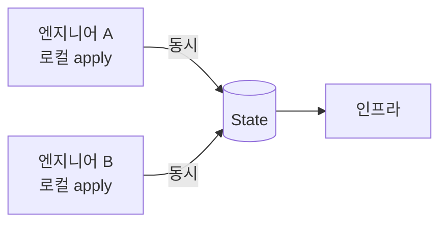
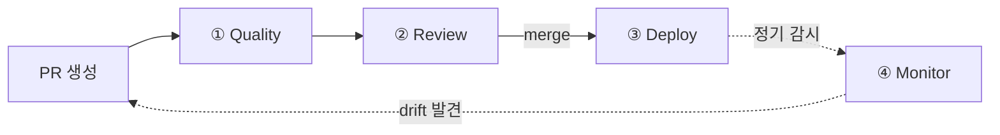
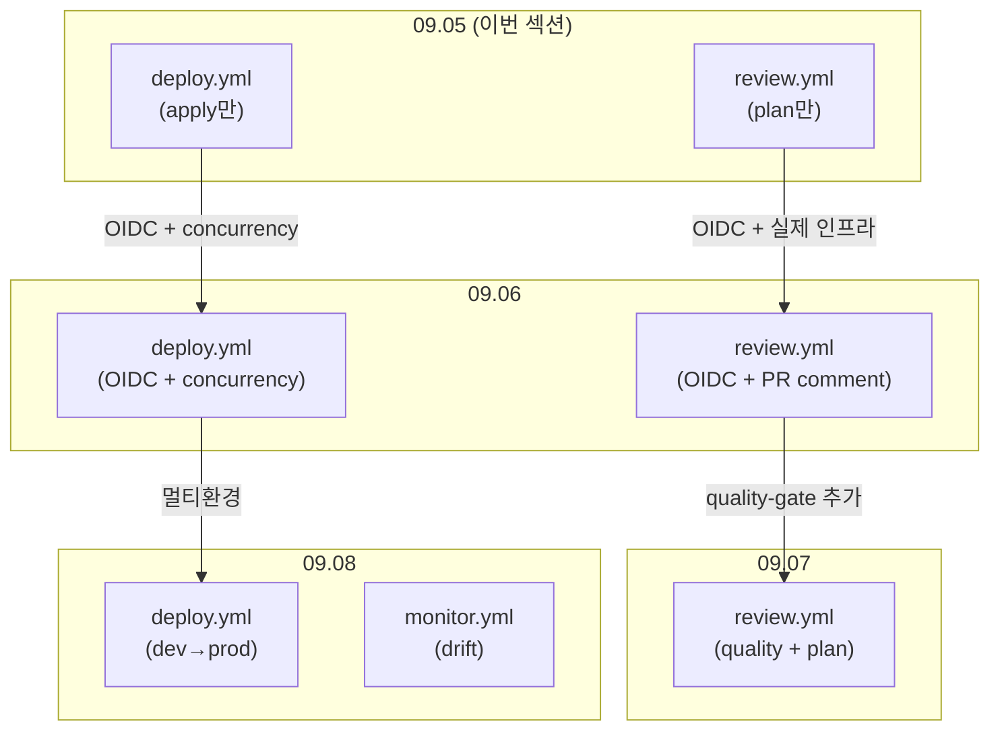
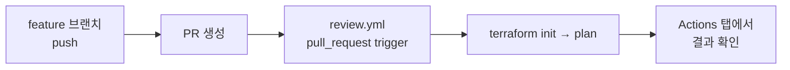
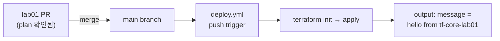
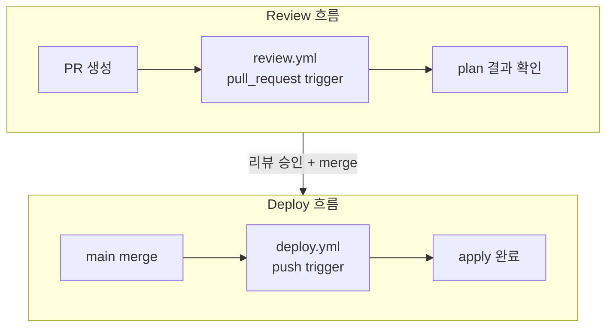

09.04에서 terraform test로 코드를 검증하는 방법을 학습했다. 하지만 모든 검증과 배포를 로컬에서 수동으로 실행하고 있다. 팀에서 인프라를 운용하려면 "누가, 언제, 어떤 변경을 apply했는가"를 통제하고 추적할 수 있어야 한다. 이번 섹션에서 IaC 파이프라인의 전체 그림을 잡고, 핵심 워크플로우 2개를 직접 만들어본다.

# 수동 apply의 위험

## 1. 팀 환경의 문제



여러 엔지니어가 동시에 apply하면 State 잠금 충돌이 발생한다. 코드 리뷰 없이 인프라를 변경할 수 있고, 누가 언제 어떤 변경을 apply했는지 기록이 남지 않는다.

| 문제 | 설명 |
|------|------|
| State 잠금 충돌 | 동시 apply 시 잠금 충돌. 누가 잠금을 잡았는지 추적이 어렵다 |
| 코드 리뷰 없는 변경 | main에 반영되지 않은 로컬 변경으로 apply 가능. 팀원 간 drift 유발 |
| 감사 추적 부재 | 누가, 언제, 어떤 변경을 apply했는지 기록 없음. 장애 시 원인 추적 불가 |

## 2. 해결: 자동화된 파이프라인

수동 apply를 금지하고, 코드 변경 → 리뷰 → 자동 배포 흐름을 강제한다. 이것을 **IaC 파이프라인**이라 한다.

---

# IaC 파이프라인 — 전체 그림

## 1. 4가지 역할

IaC 파이프라인은 4가지 역할의 워크플로우로 구성된다.



| 역할 | 질문 | 실행 시점 |
|------|------|----------|
| **Quality** | "코드가 깨끗한가?" | PR 생성 시 (plan 전) |
| **Review** | "이 변경이 안전한가?" | PR 생성 시 (plan + 결과 게시) |
| **Deploy** | "인프라를 반영한다" | main merge 시 (apply) |
| **Monitor** | "코드와 실제가 일치하는가?" | 정기 실행 (drift 감지) |

## 2. 3개 워크플로우 파일

4가지 역할을 3개 파일로 구현한다. Quality와 Review는 같은 이벤트(PR)에 반응하므로 하나의 파일에 2 jobs로 구성한다.

```text
.github/workflows/
├── review.yml      ← Quality job + Review job (PR trigger)
├── deploy.yml      ← Deploy (merge trigger)
└── monitor.yml     ← Monitor (schedule trigger)
```

| 파일 | Trigger | Jobs | 역할 |
|------|---------|------|------|
| `review.yml` | `pull_request` | quality-gate → plan | Quality + Review |
| `deploy.yml` | `push` (main) | apply | Deploy |
| `monitor.yml` | `schedule` (cron) | drift-check | Monitor |

## 3. 이 시리즈에서의 구축 로드맵

한 번에 전부 만들지 않는다. 섹션마다 하나의 워크플로우를 추가하거나 확장한다.



| 섹션 | 구축하는 것 | 파일 변화 |
|------|-----------|----------|
| **09.05** | Review + Deploy (핵심 흐름) | `review.yml`, `deploy.yml` 생성 (AWS 없이) |
| **09.06** | OIDC + 실제 인프라 연결 | `review.yml`, `deploy.yml` 확장 (AWS 연동) |
| **09.07** | Quality 추가 + branch protection | `review.yml`에 quality-gate job 추가 |
| **09.08** | Deploy 멀티환경 + Monitor | `deploy.yml` 확장 + `monitor.yml` 신규 |

이번 섹션에서는 **Review와 Deploy**, 2개의 핵심 워크플로우를 만든다. AWS 인증 없이 GitHub Actions 메커니즘 자체를 체험하는 것이 목표다.

---

# GitHub Actions 기초

## 1. 구성 요소

| 요소 | 설명 |
|------|------|
| **Workflow** | `.github/workflows/*.yml` 파일. 이벤트에 반응하여 작업을 실행한다 |
| **Trigger** | Workflow를 시작하는 이벤트. `on:` 키워드로 정의한다 |
| **Job** | 실행 단위. 하나의 Runner에서 순차적으로 step을 실행한다 |
| **Step** | Job 내 개별 명령. `run:` (쉘 명령) 또는 `uses:` (Action 호출) |
| **Runner** | Step을 실행하는 서버. `runs-on: ubuntu-latest` |

## 2. 워크플로우 파일 기본 구조

```yaml
name: Workflow 이름

on:
  pull_request:          # trigger: PR 생성 시
    branches: [main]

jobs:
  job-name:              # job 정의
    runs-on: ubuntu-latest
    steps:
      - uses: actions/checkout@v4      # step 1: 코드 체크아웃
      - run: echo "Hello from CI"      # step 2: 쉘 명령 실행
```

`on:` → `jobs:` → `steps:` 3단 구조다. 이벤트가 발생하면 job이 Runner에서 실행되고, step이 순차적으로 처리된다.

## 3. 주요 트리거

| 트리거 | 이벤트 | 이 시리즈에서의 용도 |
|--------|--------|-------------------|
| `pull_request` | PR 생성/업데이트 | Review (plan) |
| `push` | 브랜치에 push (merge 포함) | Deploy (apply) |
| `schedule` | cron 스케줄 | Monitor (drift 감지) |
| `workflow_dispatch` | 수동 실행 | 디버깅, 테스트 |

## 4. Terraform 전용 Action

`hashicorp/setup-terraform@v4`가 Runner에 Terraform CLI를 설치한다.

```yaml
- uses: hashicorp/setup-terraform@v4
  with:
    terraform_version: "1.14.6"
```

이 step 이후 `terraform init`, `terraform plan`, `terraform apply` 등을 `run:`으로 실행할 수 있다.

---

# 핵심 정리

- 팀 환경에서 수동 apply는 State 충돌, 무단 변경, 감사 추적 부재를 야기한다
- IaC 파이프라인은 4가지 역할로 구성된다: Quality, Review, Deploy, Monitor
- 3개 워크플로우 파일(`review.yml`, `deploy.yml`, `monitor.yml`)로 구현한다
- 이번 섹션에서 Review와 Deploy를 만들고, 이후 섹션에서 Quality와 Monitor를 추가한다
- GitHub Actions는 `.github/workflows/*.yml`에 워크플로우를 정의한다. `on:` → `jobs:` → `steps:` 3단 구조다
- `hashicorp/setup-terraform@v4`로 CI Runner에 Terraform을 설치한다

---

# 참고 자료

- [GitHub Actions Workflow Syntax — GitHub Docs](https://docs.github.com/en/actions/writing-workflows/workflow-syntax-for-github-actions)
- [hashicorp/setup-terraform — GitHub](https://github.com/hashicorp/setup-terraform)

---

# [실습] lab01: Review 워크플로우

`review.yml`을 작성한다. PR을 생성하면 `terraform plan`이 자동으로 실행된다. AWS 인증 없이, 가장 단순한 Terraform 코드로 GitHub Actions의 동작을 체험한다.

### 실습 목표

- `.github/workflows/review.yml` 작성
- `pull_request` trigger로 PR 생성 시 자동 실행
- `terraform plan`이 CI에서 동작하는 것을 확인
- GitHub Actions 탭에서 실행 결과 확인

---

# 1. 전체 흐름



PR을 생성하면 `review.yml`이 trigger된다. Runner에서 terraform plan이 실행되고, 결과를 Actions 탭에서 확인한다.

---

# 2. 사전 준비

- GitHub 레포지토리 (public 또는 private)
- Terraform: **`1.14.x`** (로컬에서 코드 확인용)
- AWS credential: **불필요**

**디렉토리 구조:**

```text
lab01/
├── locals.tf
├── outputs.tf
├── providers.tf
└── .github/
    └── workflows/
        └── review.yml
```

---

# 3. Terraform 코드

AWS 리소스를 생성하지 않는 최소 구성이다. locals와 output만으로 `terraform plan`이 동작한다.

## locals.tf

```hcl
locals {
  org       = "tf-core"
  project   = "lab01"
  namespace = "${local.org}-${local.project}"

  message = "hello from ${local.namespace}"
}
```

Ch04에서 도입한 `org/project/namespace` 패턴을 그대로 적용한다.

## outputs.tf

```hcl
output "message" {
  value = local.message
}
```

## providers.tf

```hcl
terraform {
  required_version = ">= 1.14.0"
}
```

AWS provider가 없다. `terraform init`은 provider 없이도 동작한다. locals + output만으로 plan과 apply가 실행 가능하다.

---

# 4. 워크플로우 작성

## .github/workflows/review.yml

```yaml
name: Review

on:
  pull_request:
    branches: [main]
    types: [opened, synchronize]

jobs:
  plan:
    runs-on: ubuntu-latest
    steps:
      - name: Checkout
        uses: actions/checkout@v4

      - name: Setup Terraform
        uses: hashicorp/setup-terraform@v4
        with:
          terraform_version: "1.14.6"

      - name: Terraform Init
        run: terraform init

      - name: Terraform Plan
        run: terraform plan
```

**한 줄씩 해설:**

| 항목 | 설명 |
|------|------|
| `name: Review` | 워크플로우 이름. Actions 탭에 표시된다 |
| `on: pull_request` | PR 생성/업데이트 시 trigger |
| `branches: [main]` | main으로의 PR만 대상 |
| `types: [opened, synchronize]` | PR 최초 생성 + 새 커밋 push 시 |
| `runs-on: ubuntu-latest` | GitHub이 제공하는 Ubuntu Runner에서 실행 |
| `actions/checkout@v4` | 레포지토리 코드를 Runner에 체크아웃 |
| `hashicorp/setup-terraform@v4` | Terraform CLI 설치 |
| `terraform init` → `terraform plan` | 순차 실행 |

이것이 **Review 워크플로우의 가장 단순한 형태**다. 09.06에서 OIDC, PR comment, 실제 인프라를 추가하면서 확장한다.

---

# 5. 테스트

## ① 레포지토리에 push

```bash
$ git init
$ git add .
$ git commit -m "feat: add review workflow"
$ git remote add origin https://github.com/OWNER/REPO.git
$ git push -u origin main
```

## ② feature 브랜치에서 PR 생성

```bash
$ git checkout -b feature/hello
$ echo '# hello' >> README.md
$ git add README.md
$ git commit -m "docs: add readme"
$ git push origin feature/hello
```

GitHub에서 `feature/hello` → `main` PR을 생성한다.

[콘솔화면: GitHub > Pull requests > New pull request > feature/hello → main > Create pull request]

## ③ Actions 탭에서 실행 확인

PR 생성 즉시 "Review" 워크플로우가 실행된다.

[콘솔화면: GitHub > Actions > Review 워크플로우 > 실행 중 — Checkout → Setup Terraform → Init → Plan 순서로 step 진행]

## ④ Plan 출력 확인

[콘솔화면: GitHub > Actions > Review > plan step 펼치기 — "Changes to Outputs: + message = hello from tf-core-lab01"]

output이 새로 추가되었으므로 `Changes to Outputs` 섹션이 표시된다. **중요한 것은 PR을 생성했을 뿐인데 plan이 자동으로 실행되었다는 것**이다.

---

# 6. 정리

리소스를 생성하지 않았으므로 `terraform destroy`가 필요 없다. PR은 merge하지 않고 lab02에서 이어간다.

---

# [실습] lab02: Deploy 워크플로우

`deploy.yml`을 작성한다. lab01의 PR을 merge하면 `terraform apply`가 자동으로 실행된다. IaC 파이프라인의 두 번째 흐름 "merge → apply"를 체험한다.

### 실습 목표

- `.github/workflows/deploy.yml` 작성
- `push` trigger로 main merge 시 자동 실행
- `terraform apply -auto-approve`가 CI에서 동작하는 것을 확인
- Review(plan)와 Deploy(apply) 워크플로우가 trigger로 분리됨을 이해

---

# 1. 전체 흐름



main에 merge(push)되면 `deploy.yml`이 trigger된다.

---

# 2. 워크플로우 작성

lab01의 디렉토리에 deploy 워크플로우를 추가한다.

## .github/workflows/deploy.yml

```yaml
name: Deploy

on:
  push:
    branches: [main]

jobs:
  apply:
    runs-on: ubuntu-latest
    steps:
      - name: Checkout
        uses: actions/checkout@v4

      - name: Setup Terraform
        uses: hashicorp/setup-terraform@v4
        with:
          terraform_version: "1.14.6"

      - name: Terraform Init
        run: terraform init

      - name: Terraform Apply
        run: terraform apply -auto-approve
```

**review.yml과의 차이:**

| 항목 | review.yml | deploy.yml |
|------|-----------|-----------|
| 이름 | `Review` | `Deploy` |
| Trigger | `pull_request` | `push` |
| 실행 시점 | PR 생성/업데이트 | main merge |
| TF 명령 | `terraform plan` | `terraform apply -auto-approve` |

같은 레포지토리에 2개의 워크플로우가 공존한다. **trigger가 다르므로 서로 다른 시점에 실행**된다.

`-auto-approve`: CI에서는 대화형 확인(`yes` 입력)이 불가능하다. 이 플래그로 확인 없이 즉시 apply한다. PR에서 plan을 리뷰했으므로 안전하다.

---

# 3. 테스트

## ① deploy.yml 추가 + PR 업데이트

```bash
$ git checkout feature/hello
$ git add .github/workflows/deploy.yml
$ git commit -m "feat: add deploy workflow"
$ git push origin feature/hello
```

lab01의 PR이 업데이트된다. Review 워크플로우가 다시 실행된다 (`synchronize` 이벤트).

## ② PR merge

[콘솔화면: GitHub > PR > Merge pull request > Confirm merge]

## ③ Deploy 워크플로우 실행 확인

merge 후 Actions 탭에서 "Deploy" 워크플로우가 자동으로 실행된다.

[콘솔화면: GitHub > Actions > Deploy 워크플로우 > 실행 완료 — Checkout → Setup Terraform → Init → Apply 단계]

## ④ Apply 출력 확인

[콘솔화면: GitHub > Actions > Deploy > apply step 펼치기 — "Apply complete!" + output 표시]

```text
Apply complete! Resources: 0 added, 0 changed, 0 destroyed.

Outputs:

message = "hello from tf-core-lab01"
```

리소스 생성 없이 output만 표시된다. **중요한 것은 merge했을 뿐인데 apply가 자동으로 실행되었다는 것**이다.

---

# 4. 두 흐름 정리



이론에서 제시한 IaC 파이프라인의 핵심 2개 흐름을 체험했다:

- **Review**: PR → `review.yml` → plan
- **Deploy**: merge → `deploy.yml` → apply

지금은 AWS 없이 locals+output만으로 동작했다. 다음 섹션(09.06)에서 이 두 워크플로우에 **OIDC 인증**과 **실제 인프라**(VPC)를 추가한다. 워크플로우 구조는 그대로이고 step만 늘어난다.

---

# 5. 정리

리소스를 생성하지 않았으므로 `terraform destroy`가 필요 없다.

---

# 핵심 정리

- IaC 파이프라인의 핵심은 2개 워크플로우다: Review(`review.yml`) + Deploy(`deploy.yml`)
- `review.yml`은 `pull_request` trigger. PR 생성 시 `terraform plan`을 실행한다
- `deploy.yml`은 `push` trigger. main merge 시 `terraform apply -auto-approve`를 실행한다
- 두 워크플로우는 같은 레포지토리에 공존하며, trigger가 다르므로 서로 다른 시점에 실행된다
- `-auto-approve`는 CI에서 대화형 확인이 불가능하기 때문에 사용한다
- 이번 섹션에서는 AWS 없이 GitHub Actions 메커니즘 자체를 체험했다
- 다음 섹션에서 OIDC + 실제 인프라로 확장한다. 워크플로우 구조는 동일하고 step이 추가된다

---

# 참고 자료

- [GitHub Actions Workflow Syntax — GitHub Docs](https://docs.github.com/en/actions/writing-workflows/workflow-syntax-for-github-actions)
- [hashicorp/setup-terraform — GitHub](https://github.com/hashicorp/setup-terraform)
- [Events that trigger workflows — GitHub Docs](https://docs.github.com/en/actions/writing-workflows/choosing-when-your-workflow-runs/events-that-trigger-workflows)
