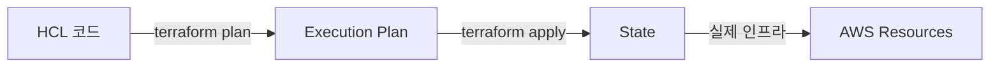
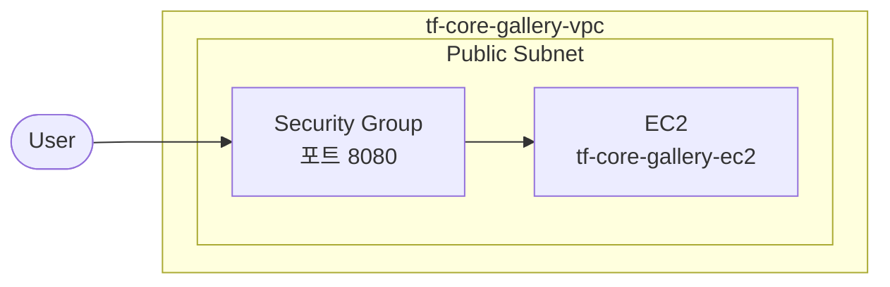

# Rule: diagram-gen

다이어그램 작성 규칙.

---

## 사용 원칙

- **mermaid 우선** — 관계도, 흐름도, 아키텍처 다이어그램
- 복잡한 네트워크 구조(VPC 중첩, 멀티 리전 등): `[이미지: ...]` 플레이스홀더
- 다이어그램 다음에는 반드시 **해설 2~4줄** 작성

---

## mermaid 타입

| 타입 | 사용 상황 |
|------|----------|
| `flowchart LR` | 요청 흐름, 리소스 연결, TF 워크플로우 (좌→우) |
| `flowchart TB` | 계층 구조, 포함 관계, 모듈 의존성 (위→아래) |
| `flowchart LR` + subgraph | VPC/Subnet 포함 구조 |

---

## 이론 섹션 다이어그램

개념 관계도 또는 Terraform 동작 흐름.



{다이어그램 해설: 무엇을 보여주는지, 읽는 순서, 핵심 포인트}

---

## 실습 전체 아키텍처 다이어그램

생성하는 AWS 리소스와 연결 구조 중심.
이번 실습에서 다루는 리소스만 포함.



{해설: 이 아키텍처가 보여주는 것, 이번 Lab의 핵심 포인트}

---

## Gallery 아키텍처 다이어그램

이번 Chapter에서 **추가/변경된 부분**을 강조.
누적 구조 전체를 그리되, 새로 추가된 리소스를 식별 가능하게.

---

## 이미지 플레이스홀더 (mermaid 대체)

복잡한 구조는 `[이미지: ...]`로 대체.
설명은 최대한 구체적으로.

```
[이미지: 전체 아키텍처 - VPC/Subnet 중첩 구조 - 멀티 모듈 의존성 흐름 - Remote Backend S3 연결]
```
