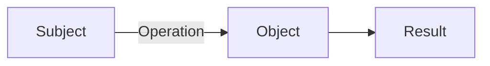
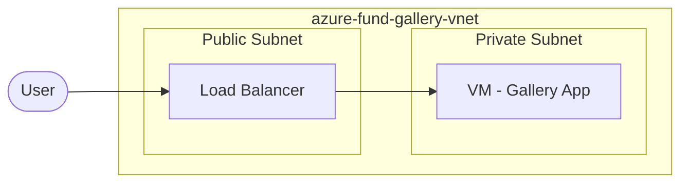

# Rule: diagram-gen

다이어그램 작성 규칙.

---

## 사용 원칙

- **mermaid 기본** — 관계도, 흐름도, 아키텍처 다이어그램은 mermaid로 그린다
- **mermaid가 어색·난해한 개념/아키텍처**(복잡한 multi-layer, 중첩, 비정형 구조 등)는 무리하지 말고
  `[이미지: ...]` 플레이스홀더에 **그림을 그릴 수 있을 만큼 *자세히* 서술**한다. 이 상세 플레이스홀더가
  곧 **별도 다이어그램 작업(그림 특화 세션)의 draw-from 스펙(핸드오프)**이다.
- 다이어그램(또는 상세 플레이스홀더) 다음에는 반드시 **해설 2~4줄** 작성

---

## 설계 원칙 (그리기 전 정한다)

**렌즈와 줌을 *먼저* 정하고, 그 렌즈에 맞는 노드만 넣는다.** 렌즈를 섞으면 다이어그램이 수프가 된다.

### 렌즈 순수성
- **flow**(요청·트래픽 흐름): 액터 → 포트·게이트 홉 → 대상. 홉과 게이트만 그린다.
- **containment**(계층·포함): 중첩 박스(리소스 그룹 → 네트워크 → 서브넷). 포함·부착만 그린다.
- **attach**(부착): 디스크·control-plane 같은 부착은 얇은 회색선 `attach`로. flow·containment와 섞지 않는다.
- 한 다이어그램에 한 렌즈. 다른 렌즈의 디테일이 필요하면 **별도 노드로 승격하지 말고 기존 노드의 속성 주석**으로 단다(예: Public IP는 별도 노드가 아니라 NIC 라벨에 `Public IP 없음`).

### 줌 = 최소 포함 경계
컨테이너 박스는 **그 실습의 관련 리소스를 다 담는 최소 경계**까지만 그린다.
- 리소스가 전부 네트워크(VNet/VPC) 안이면 **상위 박스(리소스 그룹 등)는 생략**하고 네트워크부터.
- **네트워크 밖의 상위-레벨 리소스**(예: Bastion 핸들, 공용 IP)가 있으면 그걸 담으려 상위 박스를 그린다.
- 사람(User·관리자)은 리소스가 아니라 박스 밖에 둔다.

### 격리 = 경로 부재, ≠ 차단
접근이 막힌 상태는 **경로(노드·화살표)를 아예 그리지 않아** 표현한다. 차단 표시(✗ 화살표)로 그리면 "경로는 있는데 막힘"으로 오독된다.
- 예: 공용 IP가 없어 인터넷에서 도달 못 하면 → **인터넷 노드와 화살표째 뺀다**. 해설로 "막힌 게 아니라 길이 없다".
- Deny 규칙처럼 **실제 경로 위의 명시적 차단**만 빨간 X로 표현한다.

### 리소스 사실은 hands-on이 기준
리소스가 실제로 어디에·무엇으로 생기는지는 **사용자 hands-on 실측이 기준**이다. 구현 방식(공유 풀 등)을 근거로 "리소스가 아니다·박스 밖이다"라고 **추론으로 실측을 덮지 않는다**.

---

## 핸드오프 컨벤션 (mermaid 초안 → SVG)

작성자의 mermaid는 **초안**이고, 이후 별도로 SVG로 렌더된다(구조·네이밍·렌즈·줌이 맞는 초안이어야 렌더가 깔끔하다). 아래를 지킨다.

- **게이트는 흐름의 노드**: 방화벽(NSG/ACG/Security Group 등)은 **소유 서브넷 박스 *앞*에 게이트 노드**로 둔다. 서브넷 박스 *안*에 넣지 않는다.
- **점선 = 논리·개념**: 논리 경계(서브넷)나 실물 아닌 개념은 점선. 실재 리소스는 솔리드. 솔리드 vs 점선 대비로 실재와 개념을 구분한다.
- **네이밍**: 리소스명은 정확한 mono 표기. CIDR 등은 `(10.0.1.0/24)` 괄호로 연하게. 각 노드에 **2번째 줄 서술**(포트·상태·역할: `:8080`, `static`, `Public IP 없음`).
- **액터**: 좌측 원(User는 밝게, 관리자는 진하게), 박스 밖.
- 색·팔레트는 렌더 단계에서 최종 결정한다. 작성자는 **구조·라벨·렌즈·줌**을 책임진다.

---

## mermaid 타입

| 타입 | 사용 상황 |
|------|----------|
| `flowchart LR` | 요청 흐름, 리소스 연결 (좌→우) |
| `flowchart TB` | 계층 구조, 포함 관계 (위→아래) |
| `flowchart LR` + subgraph | VNet, Subnet 포함 구조 |

---

## 이론 섹션 다이어그램

개념 관계도 또는 동작 흐름.



{다이어그램 해설: 무엇을 보여주는지, 읽는 순서, 핵심 포인트}

---

## 실습 전체 아키텍처 다이어그램

생성하는 리소스와 연결 구조 중심.
이번 실습에서 다루는 부분만 포함 — 전체 인프라 다 그리지 않음.



{해설: 이 아키텍처가 보여주는 것, 이번 Lab의 핵심 포인트}

---

## Gallery 아키텍처 다이어그램

이번 Chapter에서 **추가/변경된 부분**을 강조.
누적 구조 전체를 그리되, 새로 추가된 리소스를 식별 가능하게.

---

## 이미지 플레이스홀더 (mermaid 대체 = draw-from 스펙)

mermaid가 어색·난해하면 `[이미지: ...]`로 대체하되, **나중에 그림으로 그릴 수 있을 만큼 상세히** 서술한다.
구성 요소·배치·연결·강조점을 모두 적는다(핸드오프 스펙).

```
[이미지: 전체 아키텍처 - Public/Private Subnet 분리 강조 - NAT Gateway Outbound 경로 - Inbound 차단 표시]
```
