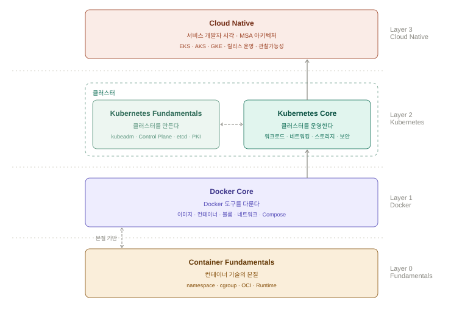
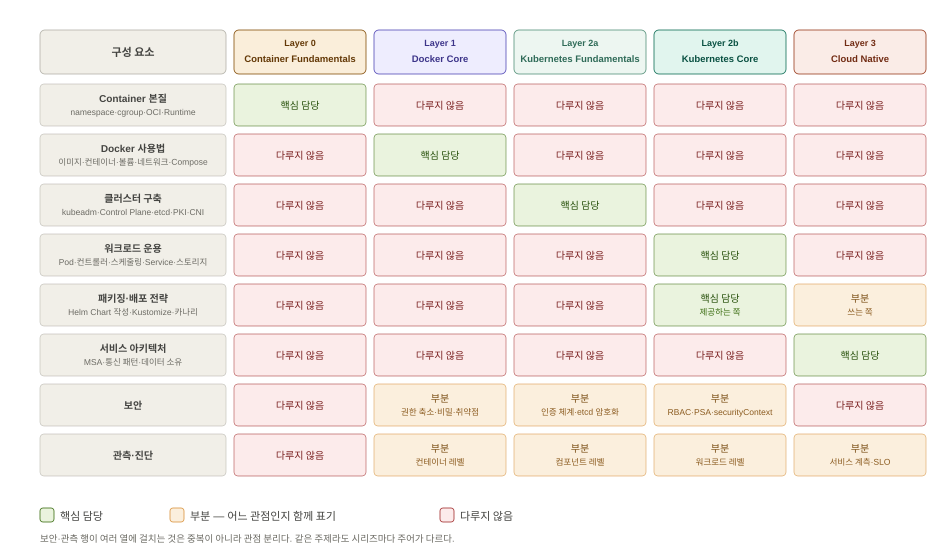

# Container Series

## 이 시리즈가 만들어진 배경

컨테이너를 다루는 책과 강의는 많다. 그런데 반복되는 문제가 있다.

Docker 사용법부터 시작한다. `docker run`, `docker build`, `docker compose up` — 명령어를 익히고 따라하다 보면 어느 순간 돌아가긴 한다. 그런데 왜 돌아가는지 모른다. namespace가 뭔지, cgroup이 뭔지, OCI가 왜 존재하는지 모른 채 툴을 쓴다.

그러면 툴이 복잡해 보이기 시작한다. 복잡해 보이니까 그 위에 또 툴을 만든다. Helm, Kustomize, Operator, ArgoCD, Backstage — 각자 복잡성을 풀겠다고 만든 툴들이 쌓이고 섞인다. 밑은 안 보이고 툴만 보이니 "K8s가 복잡하다"는 말이 나온다. 복잡한 게 아니라 본질을 모르고 쓰면 복잡해 보이는 것이다.

Kubernetes도 마찬가지다. 사실상 표준 오케스트레이터가 됐지만 "너무 어렵다"는 말이 넘친다. 본질은 단순하다 — 컨테이너를 어디서 어떻게 실행할지 선언하면 알아서 맞춰준다. 이걸 알면 위에 뭐가 쌓여도 "이게 이걸 편하게 하려는 거구나"가 보인다.

또 하나의 문제가 있다. 컨테이너를 "인프라 엔지니어의 영역"으로만 다룬다. 그런데 서비스 개발자 입장에서 보면 얘기가 다르다. 온프레미스든 클라우드든 IaC든 — 인프라가 아무리 코드화돼도 서비스 개발자에게는 여전히 부담이다. 그들에게 필요한 건 인프라를 직접 다루는 법이 아니라, 자신의 서비스가 클라우드 위에서 어떻게 살아가는지 이해하는 것이다. 그 답이 Docker와 Kubernetes다.

이 시리즈는 그 공백을 채운다. 툴 이전에 본질부터 — Container 기술의 본질을 이해하고, Docker를 제대로 다루고, Kubernetes로 오케스트레이션을 익히고, Cloud Native로 서비스 개발자의 시각에서 클라우드 위에서 서비스를 개발·배포·운영하는 흐름을 하나로 잇는다.

---

## 시리즈 철학

컨테이너를 제대로 다룬다는 것은 툴을 쓸 줄 아는 것이 아니다. 툴 아래에 있는 본질을 이해하고, 그 위에서 서비스를 구조적으로 개발·배포·운영할 수 있는 것까지다. 이 시리즈는 본질부터 Cloud Native까지 — 그 전체 흐름을 하나로 잇는다.

---

## 시리즈 구성 원칙

**각 시리즈는 독립적으로 완결된다.** 앞 레이어를 학습하지 않아도 그 시리즈만으로 목표에 도달할 수 있다.

**그리고 순서대로 엮이면 각각을 따로 학습한 것 이상의 결과가 나온다.** 그것이 이 시리즈를 레이어로 구성한 이유다.

### 같은 용어가 두 시리즈에 나오는 것은 중복이 아니다

**주어가 다르면 다른 내용이다.** 양쪽을 모두 학습한 사람에게는 반복이 아니라 결합이다.

| 대상 | Container Fundamentals | Docker Core |
|------|----------------------|-------------|
| 레이어 | 이미지가 왜 레이어인가. OCI가 무엇을 규정하는가 | 레이어를 알고 명령을 정렬해 빌드를 빠르게 한다 |
| 격리 | namespace가 무엇을 어떻게 분리하는가 | 격리 수준을 선택하고 권한을 줄인다 |
| 실행 | `docker run` 이 런타임까지 도달하는 경로 | `docker run` 옵션으로 실행 조건을 정한다 |

| 대상 | Kubernetes Fundamentals | Kubernetes Core |
|------|------------------------|-----------------|
| 인증·인가 | 인증 체인 전체, 사용자 인증서 발급 | 워크로드의 ServiceAccount와 최소 권한 |
| Pod Security | PSA admission 메커니즘 | `securityContext` 작성과 PSA 적용 |
| 트러블슈팅 | 컴포넌트 레벨 | 워크로드 레벨 |

---

## 레이어 구조

번호는 기술이 쌓이는 순서다. **수강 순서를 강제하지 않는다.**



### Layer 0 — Container Fundamentals

Docker를 렌즈로 Container 기술의 본질을 다룬다. namespace, cgroup, OCI, Container Runtime, Docker Architecture, `docker run` 실행 과정 — 툴 이전에 "왜 컨테이너인가"와 "어떻게 작동하는가"를 이해한다.

**Docker가 목적이 아니라 수단이다.** 산업에서 사실상 표준 컨테이너 엔진이므로 Docker로 실습하고 그 내부를 살펴본다.

### Layer 1 — Docker Core

Docker 도구 자체를 깊게 다룬다. 이미지·컨테이너·Volume·Networking·Compose — "어떻게 쓰는가"에 집중한다. 로컬 개발 환경부터 프로덕션 구성까지.

**Layer 0과 상호 필수 선행이 아니다.**

```
Container Fundamentals → Docker Core    "그래서 이렇게 쓴다"
Docker Core → Container Fundamentals    "그래서 그랬구나"
```

사용법으로 시작해 원리가 궁금해지는 경로와, 원리를 먼저 잡고 도구로 내려오는 경로가 모두 성립한다.

### Layer 2a — Kubernetes Fundamentals

kubeadm을 렌즈로 클러스터의 본질을 다룬다. Control Plane 컴포넌트, PKI와 인증 체계, CNI, etcd, API Server의 인증·인가·Admission — 관리형 Kubernetes가 대행하는 영역을 직접 세워보고 만진다. Layer 0이 Docker를 렌즈로 컨테이너 본질을 보는 것과 같은 구조다.

**이해의 깊이이면서 동시에 별도의 실무 능력이다.** 관리형 Kubernetes만 쓴다면 선택이지만, 클러스터를 직접 구축하거나 컴포넌트 레벨 장애를 진단해야 하는 자리에서는 선택이 아니다.

### Layer 2b — Kubernetes Core

클러스터 위에서 애플리케이션을 설계·배포·운영·보안한다. 클러스터의 출처와 무관한 공통 운영 영역을 다룬다. **클러스터 구축은 다루지 않는다.**

Layer 2a와 **상호 필수 선행이 아니다.** 클러스터를 만드는 쪽과 쓰는 쪽으로 나뉘며 어느 쪽을 먼저 학습해도 된다.

### Layer 3 — Cloud Native

서비스·애플리케이션 개발자의 자리다. Layer 2에서 K8s 엔지니어가 플랫폼을 제공하고, 개발자가 그 위에 서비스 아키텍처를 구현하는 모습이 Cloud Native다.

**여기서는 K8s 언급을 자제한다.** 사용법은 Kubernetes Core가 이미 했다. 주어가 K8s 리소스가 아니라 서비스여야 한다. EKS·AKS·GKE는 실행 기반일 뿐이며, MSA 설계와 서비스 아키텍처 판단이 핵심이다.

---

## 목표별 학습 경로

무엇을 하려는지에 따라 경로를 고른다. **각 경로가 완결된 목표를 갖는다.** 남은 레이어는 못 한 것이 아니라 아직 필요하지 않은 것이다.

| 목표 | 경로 |
|------|------|
| 컨테이너로 애플리케이션을 만들고 배포한다 | **Docker Core** |
| 컨테이너 기술 자체를 이해한다 | **Container Fundamentals** → Docker Core |
| 관리형 Kubernetes 위에 서비스를 올린다 | Docker Core → **Kubernetes Core** |
| 클러스터를 직접 구축하고 운영한다 | Docker Core → **Kubernetes Fundamentals** → Kubernetes Core |
| 서비스 아키텍처를 설계한다 | Docker Core → Kubernetes Core → **Cloud Native** |

**Docker Core는 Kubernetes Core의 선행 과정이다.** 그 외의 순서는 목표에 따라 선택한다.

---

## 시리즈 목록 및 스코프 정의



```
Learning Series/
├── Assets/                              ← 시리즈 공용 (Container 바깥)
│   ├── container-series-hierarchy.svg
│   └── container-series-coverage-mapping.svg
└── Container/
    ├── README.md
    ├── Container Fundamentals/      Layer 0
    ├── Docker Core/                 Layer 1
    ├── Kubernetes Fundamentals/     Layer 2a
    ├── Kubernetes Core/             Layer 2b
    ├── Cloud Native/                Layer 3
    └── Workloads/                   공용 실습 앱
```

### Layer 0 — Container Fundamentals

**공통 원칙:** Docker를 렌즈로 Container 기술의 본질을 이해한다. 여기서 다루는 모든 것은 "왜"와 "어떻게 작동하는가"에 집중한다.

| 다루는 것 | 다루지 않는 것 |
|----------|---------------|
| Container 기술 본질 — namespace·cgroup·OCI·Container Runtime(runc·containerd) | Docker 사용법 (이미지·컨테이너 다루기) |
| Docker Architecture·Engine 구조·`docker run` 실행 과정 | Compose |
| Docker와 OCI의 관계, Docker CLI 구조와 진화 | Orchestration |

### Layer 1 — Docker Core

**공통 원칙:** Docker 도구 자체를 깊게 다룬다. "어떻게 쓰는가"에 집중한다.

작동 원리를 서술할 때는 **문장의 주어가 사용자 또는 Docker 명령인 범위까지만** 다룬다. 주어가 커널·런타임·데몬 내부이면 Container Fundamentals가 담당한다.

- 컨테이너 실행과 생명주기 — 실행 옵션, 상태, 재시작 정책, 관찰과 디버깅, 리소스 제한
- 이미지와 레지스트리 — 레이어, 참조와 태그, 관리, 멀티 플랫폼 이미지
- Dockerfile과 빌드 — 명령어 체계, `CMD`·`ENTRYPOINT`, 빌드 캐시
- 빌드 최적화 — 멀티스테이지, 베이스 선택, BuildKit 마운트, 멀티 플랫폼 빌드
- 데이터 영속성 — 볼륨, 바인드 마운트, tmpfs
- 네트워크 — 이름 해석, 포트 게시와 노출 범위, 계층 분리
- Docker Compose — 서비스 정의, 기동 순서, 구성 분리, 운영 명령
- 개발 환경과 워크플로우 — 개발·운영 구성 분리, 소스 동기화, 빌드 캐시 재사용
- 프로덕션과 보안 — 권한 축소, 비밀 취급, 취약점 점검, 운영 구성
- 다루지 않는 것: Container 기술 본질(Fundamentals 담당), Orchestration, CI 파이프라인 구성

### Layer 2a — Kubernetes Fundamentals

**공통 원칙:** kubeadm을 렌즈로 클러스터 본질을 이해한다. kubeadm이 목적이 아니라 수단이다. 관리형 Kubernetes가 대행하는 것은 사라진 것이 아니라 추상화된 것이다.

- 클러스터 구조 — Control Plane 컴포넌트, Node 컴포넌트, static pod
- kubeadm으로 클러스터 구축 — PKI, kubeconfig, 부트스트랩 전 과정
- 노드 조인 — Bootstrap Token, TLS Bootstrapping, CSR
- CNI — Pod 네트워크 모델, 설치, 인터페이스 바인딩
- etcd — 상태 저장, 백업·복구, 장애 시나리오
- API Server — 인증 → 인가(RBAC) → Admission
- 클러스터 운용 — 인증서 갱신, 업그레이드, 노드 유지보수, 컴포넌트 트러블슈팅
- 관리형 Kubernetes가 추상화한 내부 구조 — EKS·AKS·GKE 대조
- 실습 환경: VM 3대 (VirtualBox + Rocky Linux)
- 다루지 않는 것: 워크로드 운용(Layer 2b 담당), 애플리케이션 실습, 런타임·공급망 보안 심화

### Layer 2b — Kubernetes Core

**공통 원칙:** 클러스터는 있다. 그 위에서 애플리케이션을 설계·배포·운영·보안한다. Docker Core를 알고 있다고 가정한다.

- 워크로드 — Pod, 컨트롤러, 스케줄링과 가용성
- 네트워킹 — Service, Gateway API, NetworkPolicy
- 스토리지 — PV·PVC·StorageClass, 상태 저장 워크로드
- 설정과 격리 — Namespace, ResourceQuota·LimitRange, ConfigMap·Secret, CRD 사용
- 보안 — ServiceAccount, RBAC, `securityContext`, Pod Security Standards
- 배포와 패키징 — **Helm Chart 작성**, Kustomize overlay 설계, 배포 전략
- 관측과 트러블슈팅 — 로그·이벤트·메트릭, HPA, 워크로드 진단
- 실습 환경: 멀티노드 클러스터 (kind 또는 Layer 2a에서 구축한 kubeadm 클러스터)
- 다루지 않는 것: 클러스터 구축·Control Plane 내부(Layer 2a 담당), 서비스 아키텍처 설계(Layer 3 담당)

### Layer 3 — Cloud Native

**공통 원칙:** 서비스 개발자의 시각. K8s 엔지니어가 제공한 플랫폼을 **받아 쓰는 쪽**이다. 어떤 문단의 주어가 K8s 리소스라면 그 내용은 Kubernetes Core 것이다.

- Cloud Native란 무엇인가 — 애플리케이션이 클라우드의 원주민이 된다는 것
- MSA 설계 — 서비스 분해 기준, 경계 설정, 서비스 간 계약
- 서비스 간 통신 — 동기·비동기, 이벤트 기반, 회복탄력성 패턴
- 데이터 아키텍처 — 서비스별 데이터 소유, 상태를 어디에 둘 것인가
- 릴리스 운영 — CI/CD, GitOps, 릴리스 전략의 선택과 운영
- 관찰가능성 — 서비스 계측, 분산 추적, SLO
- 실행 기반: EKS·AKS·GKE (수단으로만)
- 다루지 않는 것: K8s 리소스 사용법·Helm Chart 작성·Kustomize 설계(Layer 2b 담당), 클러스터 구축(Layer 2a 담당), 클라우드 인프라 설계(Cloud Series 담당)

---

## 공용 실습 앱

`Workloads/` 는 시리즈 전체가 공유하는 애플리케이션을 담는다. **같은 앱이 레이어를 따라 올라간다.**

| 앱 | 런타임 | 용도 |
|----|--------|------|
| **gallery-spring-boot** | Spring Boot 3.5.x / Java 21 | 메인 실습 대상. Docker Core와 Kubernetes Core가 챕터마다 확장한다 |
| identicon | Spring Boot 3.3.x / Java 21 | 보조 서비스 |
| gallery-asp-dotnet | .NET 8 | gallery-spring-boot의 포팅. 도메인·엔드포인트·화면이 대칭이다 |

```
Docker Core        이미지를 만든다        gallery:local
      ↓
Kubernetes Core    클러스터에 배포한다     Deployment → Service → PVC → Helm
      ↓
Cloud Native       서비스로 설계한다       아키텍처·릴리스·관측
```

학습자가 매번 새 예제를 익히지 않고 **실행 방식의 차이에 집중**할 수 있다.

> 앱 소스의 정본은 `Cloud/Workloads/` 다. 세 트랙(`Cloud/`, `Container/`, `System/`)이 같은 소스를 공유한다.

---

## 시리즈 간 경계 원칙

문서 작성 중 어떤 내용을 얼마나 깊게 다룰지 판단이 필요할 때 아래 원칙을 따른다.

**Container 기술 본질 (namespace, cgroup, OCI 등)**
→ Container Fundamentals 담당. 상위 레이어에서는 **문장의 주어가 커널·런타임·데몬 내부가 되는 서술을 하지 않는다.** 필요하면 사실 진술 1회로 그치고 메커니즘은 설명하지 않는다.

**Docker 사용법**
→ Docker Core 담당. Container Fundamentals에서는 사용법이 아닌 작동 원리에 집중.

**클러스터 구축·Control Plane 내부 (kubeadm, etcd, CNI 설치, 인증서, Admission 플래그)**
→ Kubernetes Fundamentals 담당. Kubernetes Core는 클러스터가 있다고 전제한다.

**Orchestration 메커니즘**
→ Kubernetes Core 담당. Cloud Native에서는 알고 있다고 가정하고 설명 없이 사용.

**같은 이름이 Fundamentals와 Core 양쪽에 나오는 주제**
→ **주어로 가른다.** 「시리즈 구성 원칙」의 대조표를 따른다.

**같은 도구가 Layer 2b와 Layer 3에 모두 나올 때 (Helm·Kustomize·배포 전략·관측)**
→ **역할로 가른다.** 플랫폼으로 **제공**하는 쪽이면 Kubernetes Core, 제공받아 **서비스를 얹는** 쪽이면 Cloud Native. 예를 들어 Helm Chart를 작성해 제공하는 것은 Core, 그 차트로 자기 서비스를 배포하는 것은 Cloud Native다.

**인프라 설계 전략 (멀티클러스터, 네트워크 설계 등)**
→ Cloud Series Architecture & Design 담당. Cloud Native에서는 서비스 개발자 시각을 벗어나지 않는다.

**MSA 설계 당위 ("왜 이렇게 나눠야 하는가")**
→ Cloud Native 담당. Kubernetes Core에서는 메커니즘만 보여주고 당위 설명은 최소화.

**Cloud Native vs Cloud Series 경계**
→ Cloud Native는 서비스가 주인공 — 서비스 개발·배포·운영 패턴 중심. Cloud Series는 인프라가 주인공 — 인프라를 코드로 다루는 것 중심. 같은 EKS·AKS·GKE를 다뤄도 시각과 추상화 계층이 완전히 다르다.
