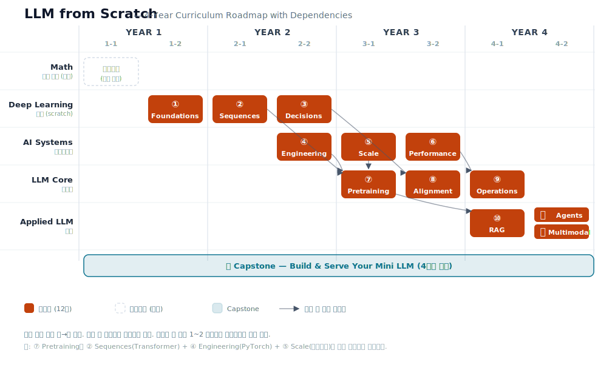

# LLM from Scratch

> 퍼셉트론에서 LLM까지, 4년에 걸쳐 직접 만들며 배우는 딥러닝 풀스택 교재 컬렉션.

**4 트랙 · 12 시리즈 · 한국어 · 본문 CC BY-SA 4.0 / 코드 MIT**

---

## 무엇인가

**LLM from Scratch** 는 컴퓨터과학 학부 4년 동안 학생이 *현대 LLM을 처음부터 끝까지 직접 만들 수 있게* 안내하는 12권의 기술문서 시리즈다.

- 1·2학년: NumPy로 신경망 기초부터 Transformer까지 *직접 구현*
- 2·3학년: PyTorch로 전환, 대규모 학습·추론 인프라 학습
- 3·4학년: 현대 LLM의 사전학습·정렬·운영·응용

졸업 시점에 학생은 **1B급 미니 LLM 1개를 본인 손으로 사전학습 → 정렬 → 서빙까지** 마칠 수 있는 역량을 가진다.

---

## 왜 만드는가

기존 시중 자료는 다음 셋 중 하나의 한계를 갖는다.

1. **수학을 회피한다.** "복잡한 수식은 생략한다"는 한 줄로 학생을 막다른 길에 세운다. 수학 백그라운드가 없는 학습자는 혼자 학습을 이어가기 어렵다.
2. **이론과 엔지니어링이 분리돼 있다.** 이론서는 NumPy로 끝나고, 엔지니어링서는 추상적인 API만 다룬다. 둘을 잇는 다리가 없다.
3. **LLM 시대를 반영하지 않는다.** 대부분의 교재가 Transformer 이전에 멈춰 있고, 사전학습·RLHF·서빙은 흩어진 블로그 글로만 존재한다.

이 컬렉션은 셋을 한 번에 해결한다.

- **수학을 회피하지 않는다.** 종이책의 지면 제약에서 자유로운 디지털 매체에서 수식 유도를 끝까지 적는다.
- **scratch와 framework를 시간순으로 분리한다.** 처음 3 시리즈는 NumPy만 사용해 학습 메커니즘을 *몸에 새기고*, 그 다음 3 시리즈에서 PyTorch로 본격적인 산업 도구를 익힌다. "여기서부터 프레임워크를 쓴다"는 경계가 시간적으로 명확하다.
- **현대 LLM을 정면으로 다룬다.** BPE 토크나이저·RoPE·RMSNorm·SwiGLU·GQA·FSDP·DPO·vLLM·LLMOps까지, 현역 LLM 엔지니어의 도구 일체를 다룬다.

---

## 4 트랙 × 12 시리즈

### Track A — Deep Learning *(이론, NumPy scratch)*

신경망이 왜·어떻게 학습하는가를 수식과 코드로 증명한다.

| # | 시리즈 | 학기 | 한 줄 |
|---|---|---|---|
| ① | Deep Learning: Foundations | 1-2 | 퍼셉트론에서 CNN까지, NumPy로 직접 짜는 신경망 |
| ② | Deep Learning: Sequences | 2-1 | RNN에서 Transformer까지, 시퀀스 모델의 진화 |
| ③ | Deep Learning: Decisions | 2-2 | MDP에서 Actor-Critic까지, 강화학습 입문 |

### Track B — AI Systems *(엔지니어링, PyTorch 전환)*

직접 짠 알고리즘을 산업 도구 위에서 다시 짓는다.

| # | 시리즈 | 학기 | 한 줄 |
|---|---|---|---|
| ④ | AI Systems: Engineering | 2-2 | PyTorch·autograd·학습 파이프라인의 기본 |
| ⑤ | AI Systems: Scale | 3-1 | DDP·FSDP·데이터 엔지니어링으로 모델을 키운다 |
| ⑥ | AI Systems: Performance | 3-2 | CUDA·Triton·추론 최적화의 첫 걸음 |

### Track C — LLM Core *(전문화)*

현대 LLM 한 개를 처음부터 끝까지 책임진다.

| # | 시리즈 | 학기 | 한 줄 |
|---|---|---|---|
| ⑦ | LLM Core: Architecture & Pretraining | 3-1 | BPE·현대 Transformer 변형·사전학습 데이터·스케일링 |
| ⑧ | LLM Core: Alignment & Evaluation | 3-2 | SFT·RLHF·DPO·표준 벤치마크 평가 |
| ⑨ | LLM Core: Operations | 4-1 | vLLM·KV cache·양자화·LLMOps |

### Track D — Applied LLM *(응용)*

LLM을 도구가 아니라 제품으로 만든다.

| # | 시리즈 | 학기 | 한 줄 |
|---|---|---|---|
| ⑩ | Applied LLM: Retrieval & RAG | 4-1 | 임베딩·벡터DB·하이브리드 검색·RAG 평가 |
| ⑪ | Applied LLM: Agents & Tool Use | 4-2 | 에이전트 루프·도구 사용·플래닝·평가 |
| ⑫ | Applied LLM: Multimodal | 4-2 | ViT·CLIP·Vision-Language 모델 |

> **선수지식** (외부 강의·자기학습 권장): 미적분, 선형대수, 확률통계, 파이썬 기초. CS 학부 1년차 수준 과목으로 충분하다.

---

## 4년 로드맵

<p align="center">
  
</p>

- 가로 = 시간(학기), 세로 = 추상도(이론 → 시스템 → 전문화 → 응용).
- 같은 트랙 안에서는 **좌 → 우 순차** 진행 (예: ⑦ → ⑧ → ⑨).
- 트랙 간 의존성은 화살표로 명시. 학생은 한 학기에 1~2개 시리즈를 본인 페이스로 선택해 학습한다.

---

## 시리즈 의존성

각 시리즈는 선행 시리즈를 전제로 한다. 핵심 의존성:

```
[외부 수학] ──► ① Foundations
                  │
                  ├──► ② Sequences  ──┐
                  ├──► ③ Decisions ───┼──► ⑧ Alignment
                  └──► ④ Engineering ─┤
                          │           │
                          └──► ⑤ Scale ──┬──► ⑦ Pretraining ──► ⑧ ──► ⑨ Operations
                                          │            │                      ▲
                                          └──► ⑥ Performance ────────────────┘
                                                                 │
                                          ┌──────────────────────┘
                                          ▼
                                          ⑩ RAG · ⑪ Agents · ⑫ Multimodal
```

- 같은 트랙 안은 트랙 진행 순서대로 (그래프에 생략).
- 트랙을 가로지르는 의존성만 강제 선행으로 둔다.

---

## 작성 원칙

이 컬렉션 전체에 적용되는 불변 원칙. 모든 시리즈는 자신의 `CLAUDE.md`에서 이 원칙을 어떻게 구체화했는지 기록한다.

1. **4단 구조** — 모든 핵심 개념은 *수식 → 직관 → 코드 → 실험* 순서로 다룬다.
2. **수학을 회피하지 않는다** — 유도 과정을 생략하지 않는다. 학생이 종이와 펜으로 다시 따라갈 수 있어야 한다.
3. **재현 가능** — 모든 실험은 random seed 고정, 의존성·버전 명시, 단일 명령으로 실행 가능해야 한다.
4. **scratch와 framework의 명시적 분리** — Track A는 NumPy(+matplotlib)만 사용. Track B부터 PyTorch.
5. **"왜"를 먼저 답한다** — 알고리즘을 소개할 때 *어떤 문제를 푸는가* 를 먼저 명확히 한다.
6. **한국어 본문 + 영문 용어** — 본문은 한국어, 기술 용어·식별자·코드 주석은 영문 유지.

---

## 누구를 위한 자료인가

- **학부생** — 학기별 순서를 따라 4년에 걸쳐 학습. 캡스톤에서 미니 LLM을 직접 만든다.
- **다른 전공 자율학습자** — 시리즈를 독립적으로 골라 학습. 의존성 그래프를 참조해 선행 시리즈를 먼저 본다.
- **다른 강사·교수** — 시리즈를 강의 교재로 자유롭게 채택 가능 (본문 CC BY-SA 4.0).
- **현역 엔지니어** — 알고 있던 개념을 *수식부터 다시* 정리하고 싶을 때 참고서로.

---

## 도달점

졸업 시점 학생의 역량 체크리스트:

- 1B급 LLM을 본인 손으로 사전학습한 경험이 있다.
- 모든 레이어의 forward·backward를 직접 짤 수 있다.
- FSDP·DDP로 멀티 GPU 학습을 운용할 수 있다.
- SFT·DPO·RLHF를 직접 수행할 수 있다.
- vLLM·KV cache·양자화로 LLM을 서빙할 수 있다.
- 표준 벤치마크(MMLU·HellaSwag·MT-Bench 등)로 평가 리포트를 작성할 수 있다.
- 파운데이션 모델 팀에 1년차 엔지니어로 즉시 합류 가능한 수준이다.

**캡스톤 산출물**: 직접 사전학습·정렬한 100M ~ 1B급 미니 LLM + 데이터 파이프라인 + 서빙 인스턴스 + 평가 리포트. 학생의 야망과 리소스에 따라 Bronze / Silver / Gold 티어로 차등화.

---

## 저장소 · 라이선스

- **GitHub**: 본 저장소 — 시리즈별 코드, 챕터·섹션 안내 `README.md`, 본 컬렉션 `README.md`, 시리즈별 작업 가이드 `CLAUDE.md`.
- **Notion**: 본문(이론) 정리본 — 각 시리즈 진행 시 별도 안내.
- **본문 라이선스**: [CC BY-SA 4.0](https://creativecommons.org/licenses/by-sa/4.0/) — 출처표시 + 동일조건변경허락.
- **코드 라이선스**: [MIT](https://opensource.org/licenses/MIT).
- **인용**: `LLM from Scratch (https://github.com/.../llm-from-scratch)` 형태로 자유롭게 인용 가능.

---

## 이 컬렉션에서 작업하는 Claude에게

이 `README.md`는 12 시리즈가 모인 컬렉션의 **변하지 않는 컨텍스트** 다.

각 시리즈 디렉토리의 `CLAUDE.md` 를 처음 열고 작업을 시작할 때, 본 README를 먼저 읽고 *전체 컬렉션의 정체성·작성 원칙·트랙 구조·자신의 시리즈가 어디에 위치하는지* 를 확인한다.

시리즈 작업 도중 *전체 컬렉션의 방향이 흔들릴 만한 결정* 이 나오면 사용자에게 확인 후 본 README 를 갱신한다. 시리즈 내부에서만 유효한 결정은 해당 시리즈의 `CLAUDE.md` 에만 기록한다.
