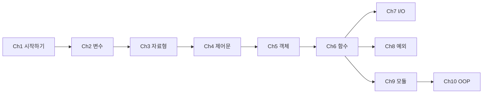

# Python Basics — 문서 전체 개요

## 1. 문서 목적

입문자와 기존 사용자 모두를 위한 **"파이썬의 사고 모델(Mental Model)"** 재정립을 목표로 한다. 문법 나열이 아닌, 파이썬이 세상을 바라보는 방식—객체, 참조, 네임스페이스, 프로토콜—을 일관되게 드러내어, "어? 내가 알던 파이썬이 아닌데?"라는 Deep Insight를 제공한다.

---

## 2. The Modern Pythonic Way — 3축

| 축 | 설명 |
|----|------|
| **펀더멘탈 충실** | 변수, 자료형, 제어문, 함수, 예외, 모듈, 클래스 등 기초를 빈틈없이 다룸 |
| **Deep Insight** | `id()`, `is` vs `==`, descriptor, `__slots__`, `-5~256` 정수 캐시, 가변 기본인자, 속성 탐색 등 내부 메커니즘으로 "왜"를 해명 |
| **Modern Python 3.10+** | `match`/`case`, Type Hints, `\|` union, `list[T]`, f-string `{x=}`, `pathlib`, `@dataclass`, `typing.Protocol`, `contextlib.suppress` 등 현대 구문·라이브러리 반영 |

---

## 3. 대상 및 전제

- **대상 버전**: Python 3.10 이상 (3.11, 3.12 기능은 해당 챕터에서 명시)
- **독자**: 프로그래밍 입문자 + 다른 언어 경험자. 기존 파이썬 사용자도 "다시 보기"용으로 활용 가능

---

## 4. 10개 챕터 흐름과 의존 관계

- **Ch1**: 실행 환경·인터프리터·venv·`__main__` — 이후 `import`, `-m`의 기반
- **Ch2**: 변수 — 이름과 값, 대입, basic 입문자 수준
- **Ch3**: 자료형과 연산자 — 내장 스칼라, sequence, dict, set, 기본 연산자 (입문자 수준)
- **Ch4**: 제어문, `match`/`case`, 이터러블 — Ch7(파일 이터레이션), Ch6(제너레이터 맛보기)와 연계
- **Ch5**: 객체 — 이름과 객체, 타입, 불변/가변, `id`/`is`/`==`, 정수 캐시, 별칭·복사, `__slots__`, 연산자·특수메서드, `|` for types (핵심 챕터)
- **Ch6**: 함수, 스코프, 인자 모델(가변 기본인자 포함), 데코레이터, Type Hints — Ch8(예외), Ch9(모듈), Ch10(메서드)의 기초
- **Ch7**: I/O, `with`, `pathlib` — 자원 관리와 스트림 사고
- **Ch8**: 예외 — Ch7 `with`, Ch6 함수와 함께 견고한 프로그램 설계
- **Ch9**: 모듈·패키지 — Ch1의 `__main__`, `-m`과 결합해 Ch10(클래스 배치)로
- **Ch10**: 클래스·OOP — Ch3(타입), Ch5(참조·`__slots__`), Ch6(데코레이터·타입 힌트) 종합

---

## 5. 챕터별 핵심 키워드 요약

| 챕터 | 핵심 키워드 |
|------|-------------|
| **Ch1 시작하기** | 인터프리터, 바이트코드, REPL/스크립트/`-m`, venv, `sys.path`, `__main__`, `python -m pip` |
| **Ch2 변수** | 이름, 대입, 값, 변수와 타입 |
| **Ch3 자료형과 연산자** | int/float/str/bytes/bool, list/tuple/range, dict, set/frozenset, 기본 연산자, f-string `{x=}` |
| **Ch4 제어문** | Truthy/Falsy, `__iter__`/`__next__`, `match`/`case`, `for`-`else`, 가드, `as` |
| **Ch5 객체** | 이름↔객체 참조, `type`/`isinstance`, 불변/가변, `id`/`is`/`==`, `-5~256` 캐시, 별칭·얕은/깊은 복사, `__slots__`, `__add__`/`__eq__`, `int\|None` |
| **Ch6 함수와 스코프** | 함수 객체, 인자 모델·가변 기본인자, `/`·`*`, LEGB, 클로저, 람다·functools, Type Hints, 데코레이터, `functools.wraps` |
| **Ch7 I/O** | 바이트/텍스트 스트림, `open(encoding=)`, `with`, `__enter__`/`__exit__`, `pathlib.Path`, `@contextmanager` |
| **Ch8 예외 처리** | `try`/`except`/`else`/`finally`, `raise from`, EAFP, `contextlib.suppress`, `ExceptionGroup`(3.11+) |
| **Ch9 모듈과 패키지** | `sys.modules`, `sys.path`, `__init__.py`, 상대 import, `__pycache__`, `pyproject.toml`, `importlib.metadata` |
| **Ch10 클래스와 OOP** | `self`/메서드 바인딩, MRO·`super()`, `@property`, descriptor, `@dataclass`, `typing.Protocol` |

---

## 6. 각 챕터 MD 파일 구성

챕터별로 `plan/0N-chapter-{이름}.md`(또는 `10-chapter-oop.md`)가 있으며, 다음 공통 구조를 가진다.

- **Chapter Definition**: 왜 필요한지, 세부 주제 나열, 간단 소개
- **Subject Definition**: 세부 주제별 개요, 목표, 내용 요약
- **Modern Key Concepts**: 해당 챕터에서 강조할 현대 파이썬 키워드

본 `00-overview.md`는 전체 로드맵으로, 각 챕터 MD는 이 개요를 전제로 상세 설계를 담는다.
